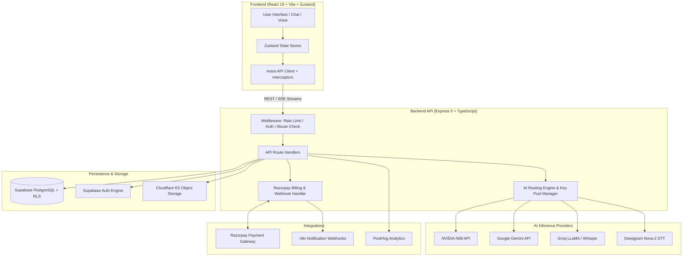
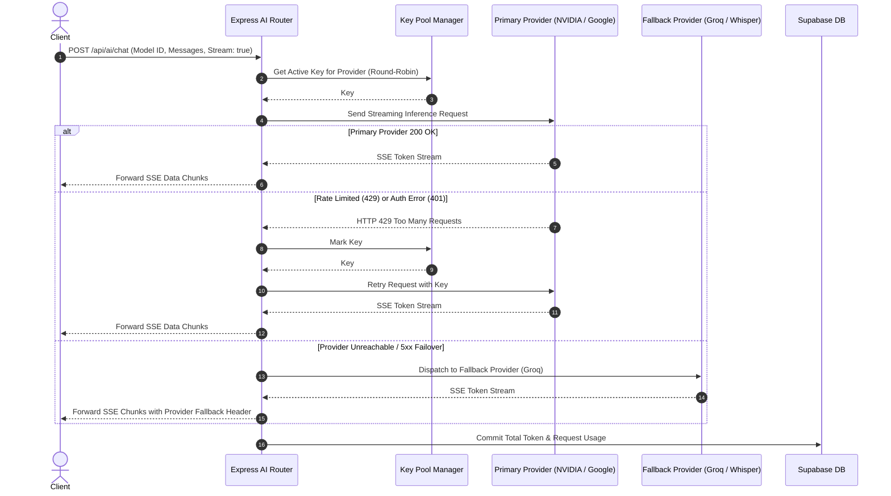
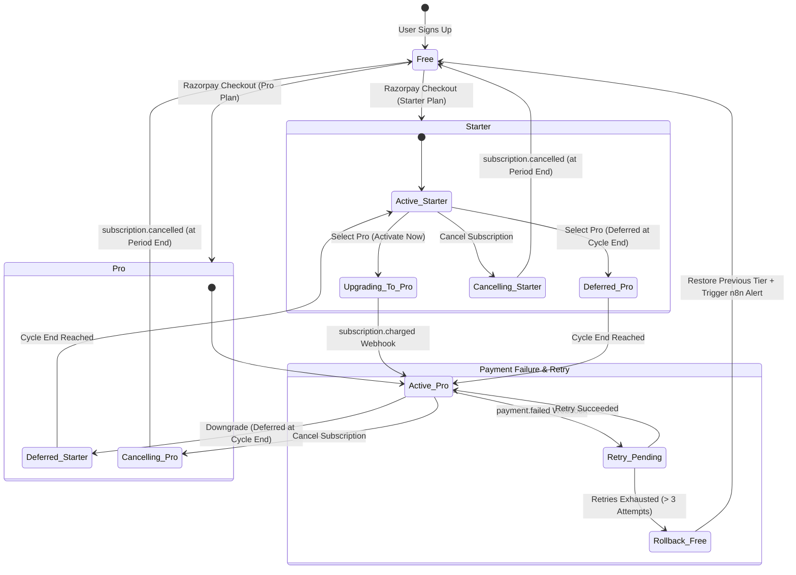

# Sree AI — Next-Generation Multi-Modal AI SaaS Platform

<div align="center">


<br />
<br />


**An enterprise-grade, multi-modal AI platform combining text reasoning, real-time voice, image/video generation, BYOK key pooling, and recurring subscription billing.**

[Features](#key-features) • [Architecture](#-system-architecture--engineering-deep-dive) • [Tech Stack](#-tech-stack) • [Quickstart](#-getting-started) • [Database Setup](#️-database--rls-setup) • [API Overview](#-api-endpoints-overview) • [Security](#-security--privacy)

</div>

---

## 🌟 Overview

**Sree AI** is a full-stack, production-ready AI SaaS platform built for high-throughput AI interactions. It offers seamless multi-provider AI model routing (NVIDIA NIM, Google Gemini, Groq, Deepgram), real-time conversational voice mode, multi-modal file analysis, image/video creation studio, a Bring-Your-Own-Key (BYOK) system with quota discounts, and an end-to-end Razorpay subscription lifecycle.

Designed with a **dual-identity architecture**, users can start chatting immediately without registration, with automatic state and quota migration upon signing up.

---

## 🚀 Key Features

### 💬 Multi-Model Conversational Chat
- **Multi-turn Contextual Chat**: Streaming completions with real-time markdown rendering, LaTeX math support, and syntax-highlighted code blocks.
- **Dynamic Model Selector**: Seamlessly switch between LLaMA 3.3/3.1, DeepSeek V3.2, Gemma 2, Nemotron, Mistral Large, Qwen, and Gemini 2.0/1.5 Flash models based on subscription tier.
- **Multi-Modal File Analysis**: Upload and analyze PDFs, Word documents (`.docx`), Excel spreadsheets (`.xlsx`), images, and text files.

### 🎙️ Real-Time Voice Assistant
- **Bi-Directional Voice Mode**: Natural voice interaction with low-latency Speech-To-Text (STT) and dynamic Text-To-Speech (TTS).
- **Cascading STT Engine**: Zero-downtime voice input with automatic fallback from Deepgram Nova-2 to Groq Whisper Large V3.

### 🎨 Creative Studio (Images & Videos)
- **AI Image Generation**: Powered by FLUX.1 (Dev/Schnell), SDXL, and SD 3.5 Large with custom prompt expansion, aspect ratios, and instant downloads.
- **AI Video Generation**: Text-to-video capabilities powered by Google Veo & Omni Flash models with automated Cloudflare R2 asset storage.

### 🔑 Bring Your Own Key (BYOK) & Key Pooling
- **Encrypted User Keys**: Users can supply their own API keys (encrypted via AES-256-GCM) to unlock extended quotas with a **0.2x rate multiplier**.
- **Backend Key Pool Rotation**: Server-side API key pool that rotates round-robin and automatically fails over when provider rate limits are hit.

### 💳 Tiered Subscriptions & Razorpay Billing
- **Flexible Tiers**: Free, Starter, and Pro plans with customizable daily, monthly, and per-minute usage quotas.
- **Smart Subscription State Machine**: Supports instant upgrades, deferred downgrades at billing-cycle end, auto-renewals, cancellation retention, and automated rollback on payment failure.
- **Webhook Idempotency**: HMAC SHA-256 signature verification with duplicate event rejection and automated n8n failure notifications.

### 🛡️ Enterprise Rate Limiting & Abuse Prevention
- **Atomic Rate Limiting Engine**: PostgreSQL RPC (`increment_multi_usage`) calculates per-minute, daily, and monthly quotas in a single atomic transaction.
- **Identity-Based Abuse Detection**: Tracks browser fingerprints, salted IP hashes, rapid-request patterns, and disposable email detection without storing raw PII.

---

## 🏗️ System Architecture & Engineering Deep-Dive

### 1. Core End-to-End Topology



---

### 2. Rate Limiting & Atomic Usage Tracking Architecture

The platform enforces quota boundaries across three time windows (**1-minute bursts**, **daily limits**, and **monthly quotas**) with single-transaction atomicity in PostgreSQL to eliminate race conditions.

```mermaid
flowchart TD
    Req[Incoming API Request] --> MW[rateLimitEnforcement Middleware]
    MW --> CheckID{Identify Caller}
    
    CheckID -->|Bearer JWT| AuthUser[Extract auth.uid\nLookup profiles.plan_type]
    CheckID -->|x-anon-id Header| AnonUser[Extract anon_id\nHash IP & Fingerprint]
    
    AuthUser --> TierLookup[Determine Tier Limits:\nFree / Starter / Pro]
    AnonUser --> TierLookup
    
    TierLookup --> BYOKCheck{Using BYOK Key?}
    BYOKCheck -->|Yes| Multiplier[Apply 0.2x Quota Multiplier]
    BYOKCheck -->|No| StdQuota[Apply 1.0x Full Quota]
    
    Multiplier --> RPC[Call PostgreSQL RPC:\nincrement_multi_usage]
    StdQuota --> RPC
    
    subgraph Postgres_RPC ["PostgreSQL Atomic Transaction"]
        RPC --> RowLock[SELECT ... FOR UPDATE on usage_tracking]
        RowLock --> WindowReset{Has Window Expired?}
        WindowReset -->|1-min passed| ResetMin[minute_count = 0]
        WindowReset -->|24h passed| ResetDay[daily_count = 0]
        WindowReset -->|30d passed| ResetMonth[monthly_count = 0]
        
        ResetMin & ResetDay & ResetMonth --> LimitCheck{Any Limit Exceeded?}
        LimitCheck -->|Yes| Rollback[Return { allowed: false, reason: 'minute|daily|monthly' }]
        LimitCheck -->|No| Commit[Increment counters + Sync profile columns\nReturn { allowed: true }]
    end
    
    Rollback -->|HTTP 429| Reject[Reject Request with Retry-After Header]
    Commit --> ExecuteAI[Forward to AI Router]
```

---

### 3. AI Model Resolution, Key Pooling & Fallback Retries

All AI requests flow through a resilient routing layer that manages API key pool rotation, provider failover, and automatic STT degradation.



---

### 4. Subscription State Machine & Webhook Retry Pipeline

The billing system handles upgrade, downgrade, deferral, and payment failure events with guaranteed idempotency and rollback safety.



---

## 💻 Tech Stack

| Layer | Technologies |
|---|---|
| **Frontend** | React 19, TypeScript, Vite, TailwindCSS, Radix UI, Lucide Icons, Zustand, Axios, Canvas Confetti |
| **Backend** | Node.js (v20+), Express 5, TypeScript, SSE (Server-Sent Events), Node Crypto (AES-256-GCM) |
| **Database & Auth** | Supabase (PostgreSQL 15+), Row Level Security (RLS), PL/pgSQL Atomic RPCs |
| **File & Media Storage** | Cloudflare R2 (S3-compatible bucket storage), Multer |
| **Payment Gateway** | Razorpay Subscriptions & Orders API, Webhook Signature Verification |
| **AI Inference** | NVIDIA NIM, Google Gemini, Groq, Deepgram |
| **Observability** | PostHog Product Analytics & Error Tracking, n8n Workflow Automations |

---

## 📁 Repository Structure

```
.
├── backend/                  # Express 5 backend service
│   ├── src/
│   │   ├── config/           # Plans, models, rate-limits, and app constants
│   │   ├── middleware/       # Auth, anonymous identity, rate-limiting, abuse prevention
│   │   ├── routes/           # AI, payment, user, auth, and feature request routes
│   │   ├── services/         # AI routing, STT fallback, key-pool, storage, usage engine
│   │   └── lib/              # Supabase admin client and helper utilities
│   └── package.json
│
├── frontend/                 # React 19 single-page application
│   ├── src/
│   │   ├── components/       # UI components, layout, modals, chat, voice, studio
│   │   ├── hooks/            # Custom React hooks (voice recording, payments, SSE)
│   │   ├── stores/           # Zustand state management (auth, chat, voice, models, UI)
│   │   ├── services/         # Frontend API integration layer
│   │   └── styles/           # Global styles and design system variables
│   └── package.json
│
├── project-context/          # Complete architectural & technical documentation
│   ├── 01-project-overview.md
│   ├── 02-tech-stack.md
│   ├── 03-architecture.md
│   ├── 04-authentication-and-users.md
│   ├── 05-payment-and-subscriptions.md
│   ├── 06-features-and-pages.md
│   ├── 07-api-reference.md
│   ├── 08-database-schema.md
│   ├── 09-ui-ux-design.md
│   ├── 10-security-and-rate-limiting.md
│   └── full-schema.sql       # 100% production-verified ready-to-run database schema
│
├── supabase/migrations/      # Sequential PostgreSQL migration files
├── .env.example              # Environment variables template
└── README.md
```

---

## 🚦 Getting Started

### Prerequisites
- **Node.js**: v20.0.0 or higher
- **npm** or **pnpm**
- **Supabase Account**: A new or existing project
- **Razorpay Account**: Live or Test Mode credentials
- **AI Provider API Keys**: At least one key from NVIDIA NIM, Google AI Studio, or Groq

---

### Installation & Setup

1. **Clone the repository:**
   ```bash
   git clone https://github.com/your-username/sree-ai.git
   cd sree-ai
   ```

2. **Install dependencies:**
   ```bash
   # Install root and backend/frontend dependencies
   npm install
   cd backend && npm install
   cd ../frontend && npm install
   cd ..
   ```

3. **Configure Environment Variables:**

   Create `.env` in `backend/`:
   ```env
   PORT=5000
   NODE_ENV=development
   FRONTEND_URL=http://localhost:5173

   # Supabase
   SUPABASE_URL=https://your-project.supabase.co
   SUPABASE_ANON_KEY=your_supabase_anon_key
   SUPABASE_SERVICE_ROLE_KEY=your_supabase_service_role_key

   # AI Provider Keys (supports single or comma-separated keys for pool rotation)
   NVIDIA_API_KEY=your_nvidia_api_key
   GOOGLE_API_KEY=your_google_gemini_key
   GROQ_API_KEY=your_groq_api_key
   DEEPGRAM_API_KEY=your_deepgram_api_key

   # BYOK Key Encryption (32-character hex key)
   ENCRYPTION_KEY=your_32_character_hex_encryption_key

   # Razorpay Payment Gateway
   RAZORPAY_KEY_ID=your_razorpay_key_id
   RAZORPAY_KEY_SECRET=your_razorpay_key_secret
   RAZORPAY_WEBHOOK_SECRET=your_razorpay_webhook_secret

   # Cloudflare R2 Storage (Optional for file uploads)
   CLOUDFLARE_R2_ACCESS_KEY_ID=your_r2_access_key
   CLOUDFLARE_R2_SECRET_ACCESS_KEY=your_r2_secret_key
   CLOUDFLARE_R2_BUCKET_NAME=your_bucket_name
   CLOUDFLARE_R2_ENDPOINT=https://your_account_id.r2.cloudflarestorage.com
   CLOUDFLARE_R2_PUBLIC_URL=https://your_public_r2_domain.dev
   ```

   Create `.env` in `frontend/`:
   ```env
   VITE_SUPABASE_URL=https://your-project.supabase.co
   VITE_SUPABASE_ANON_KEY=your_supabase_anon_key
   VITE_API_BASE_URL=http://localhost:5000/api
   ```

4. **Initialize Database:**
   Run the ready-to-use schema script in your Supabase SQL Editor:
   - Copy contents of [`project-context/full-schema.sql`](file:///p:/antygravity-projects/Ai-Sass-3/project-context/full-schema.sql) and execute.

5. **Start Local Development:**
   ```bash
   # Run Backend (Port 5000)
   cd backend
   npm run dev

   # In a separate terminal, run Frontend (Port 5173)
   cd frontend
   npm run dev
   ```

---

## 🗄️ Database & RLS Setup

The database utilizes Supabase PostgreSQL with strict Row Level Security (RLS) on all tables:

- **All-In-One Production Script**: [`project-context/full-schema.sql`](file:///p:/antygravity-projects/Ai-Sass-3/project-context/full-schema.sql)
- **Included Tables**:
  - `profiles`: User account details, legal consent, and synced limits
  - `subscriptions`: Razorpay subscription state machine
  - `payment_history`: Idempotent transaction logs
  - `conversations` & `messages`: Chat persistence (Auth & Anonymous)
  - `anonymous_users`: Identity fingerprinting and usage tracking
  - `usage_tracking`: Unified per-minute, daily, and monthly rate counters
  - `api_keys`: Encrypted BYOK key vault
  - `ai_models`: Dynamic AI model capabilities catalog
  - `feature_requests`: Integrated ticket submission and status tracking

---

## 🔌 API Endpoints Overview

| Scope | Method | Endpoint | Description |
|---|---|---|---|
| **AI** | `POST` | `/api/ai/chat` | Streaming SSE multi-turn chat completion |
| **AI** | `POST` | `/api/ai/generate-image` | Text-to-image generation |
| **AI** | `POST` | `/api/ai/generate-video` | Text-to-video generation |
| **AI** | `POST` | `/api/ai/stt` | Cascading speech-to-text audio transcription |
| **AI** | `POST` | `/api/ai/tts` | Text-to-speech voice synthesis |
| **Billing** | `POST` | `/api/payment/create-subscription` | Initiates Razorpay checkout session |
| **Billing** | `POST` | `/api/payment/verify` | Validates payment signature & activates plan |
| **Billing** | `POST` | `/api/payment/webhook` | Handles recurring charges, failures, & cancellations |
| **Billing** | `POST` | `/api/payment/cancel` | Schedules downgrade at end of current cycle |
| **User** | `GET` | `/api/user/profile` | Retrieves profile, active plan, and real-time quotas |
| **User** | `PUT` | `/api/user/profile` | Updates system prompts & personal preferences |
| **Keys** | `POST` | `/api/user/api-keys` | Saves user BYOK API key (encrypted) |
| **Feature** | `POST` | `/api/feature-requests` | Submits feature requests / bug reports |

*Detailed request/response contracts available in [`project-context/07-api-reference.md`](file:///p:/antygravity-projects/Ai-Sass-3/project-context/07-api-reference.md).*

---

## 🔒 Security & Privacy

1. **Zero Raw Key Storage (BYOK)**: User-provided API keys are encrypted at rest using `AES-256-GCM` with a unique Initialization Vector (`iv`) per key.
2. **Payment Webhook Verification**: Razorpay webhooks require strict `HMAC-SHA256` signature verification; unverified payloads are discarded immediately.
3. **No Plaintext IP Storage**: Anonymous visitors are tracked using salted SHA-256 hashes of client fingerprints and IPs to comply with GDPR & CCPA.
4. **Row Level Security (RLS)**: Enforced across 100% of exposed tables to isolate tenant data.

---

## 📄 License

This project is proprietary and closed-source. All rights reserved.

Unauthorized copying, distribution, modification, or commercial use of any part of this software without explicit permission is strictly prohibited.
