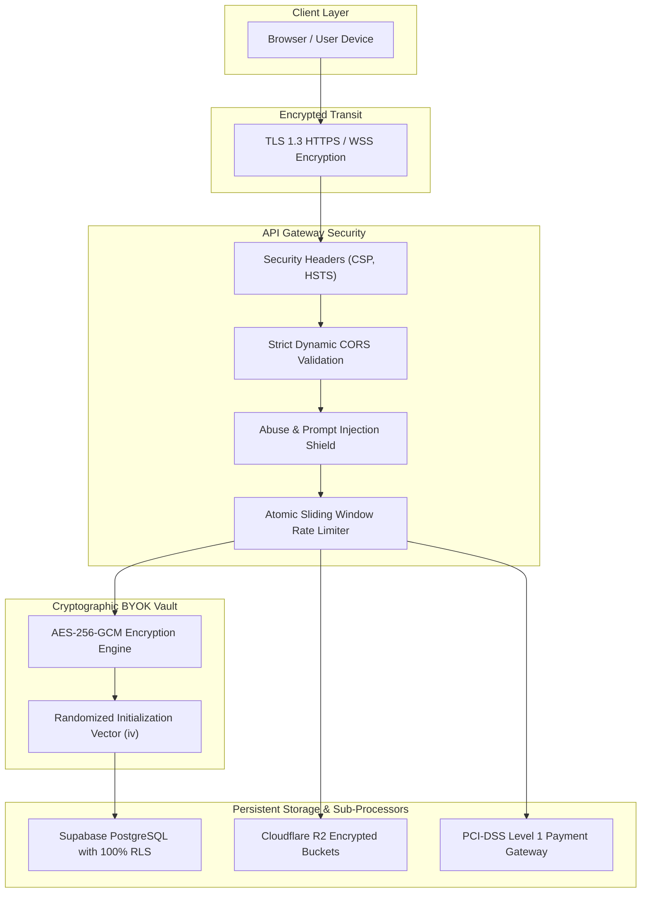

# Security & BYOK Policy — Sree AI

**Effective Date:** August 20, 2026  
**Last Updated:** August 20, 2026  
**Application:** Sree AI (accessible via [https://app.sreeai.qzz.io](https://app.sreeai.qzz.io))

---

## 1. Security Overview & Architecture Philosophy

At **Sree AI**, security and privacy are built directly into our platform architecture. As a multi-modal AI platform processing text completions, voice streams, media files, and sensitive third-party API credentials, we follow strict **Defense-in-Depth** and **Zero-Trust** security principles.

This Security & Bring Your Own Key (BYOK) Policy outlines the technical and operational controls governing data protection, cryptographic safeguards, key vaulting, and cloud infrastructure security across the Sree AI ecosystem.

---

## 2. Cryptographic Controls & Data Protection

### 2.1 Encryption in Transit
- All communication between client browsers, backend application servers, databases, and third-party AI providers is encrypted in transit using **TLS 1.3** and **TLS 1.2** with strong cryptographic cipher suites.
- HTTP Strict Transport Security (**HSTS**) headers are enforced across all domains to prevent protocol downgrade attacks.

### 2.2 Encryption at Rest & BYOK Key Vaulting
- **Algorithm:** User-supplied API keys (NVIDIA NIM, Google Gemini, Groq, Deepgram) are encrypted using **AES-256-GCM** (Advanced Encryption Standard in Galois/Counter Mode).
- **Initialization Vectors (IV):** Every encrypted key is stored alongside a unique, cryptographically random 16-byte initialization vector (`iv`). No static or reusable IVs are ever utilized.
- **Key Isolation:** Decryption occurs transiently strictly in volatile backend server memory during the execution lifecycle of the specific inference request. Raw API keys are never written to server disks, application logs, or database rows in plaintext.

### 2.3 Identity Privacy & Salted Hashing
- **Zero Plaintext IP Storage:** Client IP addresses are never stored in raw form. IP addresses are passed through a salted **SHA-256** one-way cryptographic hash before being referenced in rate limiting or abuse logs.
- **Client Fingerprint Privacy:** Browser fingerprints are securely hashed using SHA-256 to detect automated botnets and abuse vectors without storing personal hardware serials or unhashed identifiers.

---

## 3. Database Security & Row Level Security (RLS)

Our persistent data layer is hosted on Supabase PostgreSQL with mandatory **Row Level Security (RLS)** active across 100% of exposed tables:

| Table | RLS Isolation Strategy |
|---|---|
| `profiles` | Restricted strictly to `auth.uid() = id` for user reads/updates |
| `api_keys` | Restricted to `auth.uid() = user_id` (AES-256-GCM encrypted) |
| `conversations` | Dual-isolation: `auth.uid() = user_id` OR `anon_id = header('x-anon-id')` |
| `messages` | Cascade verified via parent conversation ownership `EXISTS` check |
| `subscriptions` | Read-only for `auth.uid() = user_id`; mutation restricted to `service_role` |
| `payment_history` | Read-only for `auth.uid() = user_id`; mutation restricted to `service_role` |
| `abuse_flags` | Restricted strictly to `service_role` (Hidden from all client APIs) |
| `cleanup_logs` | Restricted strictly to `service_role` (Internal automated audit log) |

---

## 4. Bring Your Own Key (BYOK) Governance

The BYOK feature enables users to connect their personal third-party AI provider credentials to Sree AI:

### 4.1 Benefits & Quota Multiplier
Users operating under BYOK mode receive a **0.2x quota multiplier** against their plan usage, enabling up to 5x more requests through our unified interface while paying their provider directly for underlying token costs.

### 4.2 User Responsibilities
1. **Third-Party Charges:** You remain solely responsible for all API usage fees, token consumption, overages, and billing disputes incurred directly on your third-party provider accounts (e.g., NVIDIA, Google Cloud, Groq, Deepgram).
2. **Key Lifecycle Management:** You are responsible for ensuring that API keys submitted to Sree AI have appropriate spending limits, permissions, and IP restrictions enabled in your provider consoles.
3. **Key Revocation:** You may rotate, modify, or permanently delete your stored BYOK keys at any time via the Settings page. Deleting a key instantly purges both the encrypted ciphertext and initialization vector from the database.

---

## 5. Shared Responsibility Model & Third-Party Risk Allocation

Security in Sree AI operates under a **Shared Responsibility Framework**:

| Domain | Responsible Entity | Scope of Security Responsibility |
|---|---|---|
| **Database & Identity Storage** | **Supabase Inc.** | Physical data centers, PostgreSQL engine patching, RLS kernel enforcement, storage hardware encryption (SOC 2 Type II). |
| **Object Storage (Files/Media)** | **Cloudflare Inc.** | S3-compatible R2 bucket encryption, edge network DDOS mitigation, global edge caching. |
| **Payment & Financial Processing** | **Razorpay Software Pvt Ltd** | Cardholder data security, payment tokenization, PCI-DSS Level 1 compliance, banking gateway encryption. |
| **AI Model Inference Execution** | **NVIDIA / Google / Groq / Deepgram** | Model serving infrastructure, GPU cluster isolation, LLM prompt transit security. |
| **BYOK Key Confidentiality & Vault** | **Sree AI & User** | Sree AI enforces AES-256-GCM encryption at rest. User is responsible for setting provider spending caps and restricting key permissions. |
| **Uploaded Document Confidentiality** | **User (100% Sole Responsibility)** | User is solely responsible for ensuring no unauthorized, illegal, or highly confidential trade secrets are uploaded without authorization. |

> **Important Limitation:** In no event shall Sree AI or its operators be held liable for security incidents, data breaches, zero-day exploits, or service interruptions that originate within the infrastructure or networks of third-party sub-processors (Supabase, Cloudflare, Razorpay, NVIDIA, Google, Groq, Deepgram) or through compromised client-side user devices.

---

## 6. Payment Security & Webhook Idempotency

- **PCI-DSS Compliance:** All payment transactions, checkout sessions, and recurring subscription billing are handled by **Razorpay Software Private Limited**, a certified **PCI-DSS Level 1** Service Provider.
- **HMAC-SHA256 Webhook Verification:** Inbound payment webhooks (`subscription.charged`, `payment.failed`, `subscription.cancelled`) are validated using cryptographic **HMAC-SHA256** signatures against `RAZORPAY_WEBHOOK_SECRET`. Unsigned or mismatched payloads are rejected immediately.
- **Idempotency Safeguards:** Every payment ID (`razorpay_payment_id`) is enforced as a unique constraint in the `payment_history` database table, preventing duplicate subscription credits or double-billing in the event of webhook replay attacks.

---

## 7. Abuse Prevention & Rate-Limiting Engine

To protect system availability from automated botnets, credential stuffers, and distributed denial-of-service (DDoS) threats, Sree AI employs an automated protection pipeline:
1. **Atomic Quota Engine:** Quotas are enforced in a single transaction via PostgreSQL RPC (`increment_multi_usage`) with row-level locks (`FOR UPDATE`), preventing concurrent burst bypasses.
2. **Datacenter & VPN Heuristics:** Automated abuse detection middleware flags suspicious high-frequency requests originating from automated hosting proxies or disposable accounts.
3. **Automated Storage Purging:** S3-compatible Cloudflare R2 temporary media buckets are regularly audited and purged via background cleanup jobs (`cleanup_logs`) to prevent orphaned data accumulation.

---

## 8. Vulnerability Disclosure & Bug Bounty

We welcome security researchers and ethical hackers to responsibly test and disclose vulnerabilities:

### 8.1 Reporting Guidelines
If you discover a security vulnerability in Sree AI, please notify us immediately at:
- **Email:** `security@sreeai.qzz.io`
- **Subject:** `[Vulnerability Disclosure] - Brief Vulnerability Title`

### 8.2 Safe Harbor Rules
When conducting research in good faith:
- Do not access, modify, or destroy another user's personal data.
- Do not execute destructive Denial of Service (DoS) attacks or automated brute-force attempts against production infrastructure.
- Provide a reasonable timeframe (minimum 30 days) for our engineering team to remediate the vulnerability before public disclosure.
- We will acknowledge receipt of your report within 48 hours and provide remediation updates.
