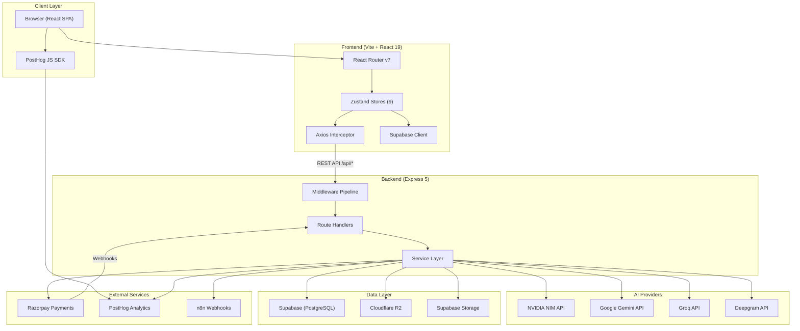
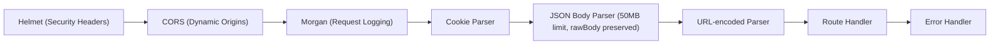
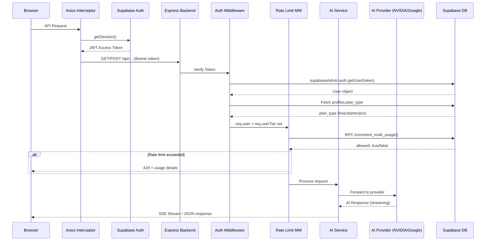
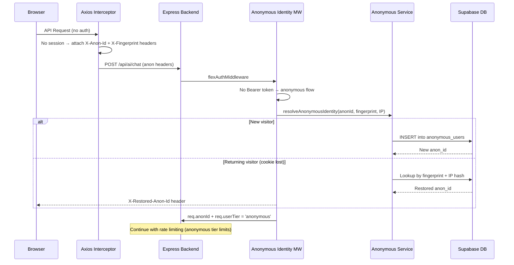
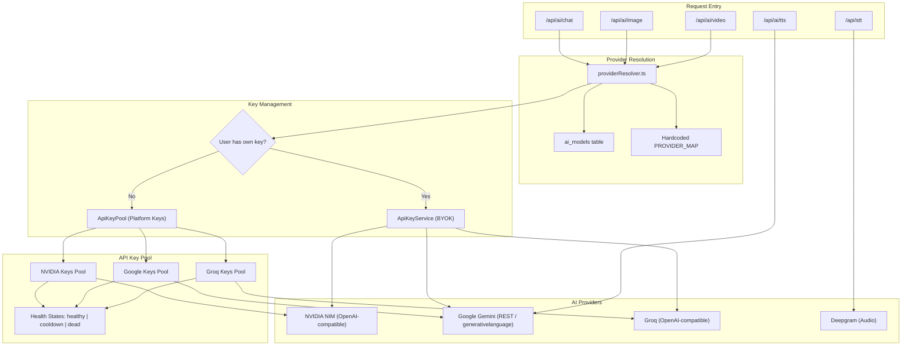
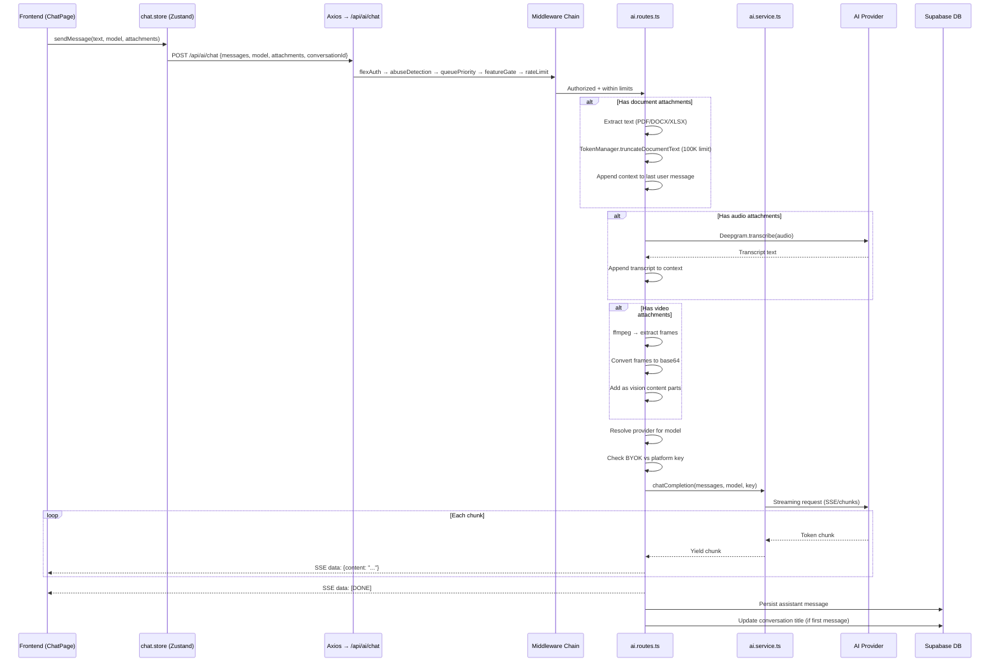
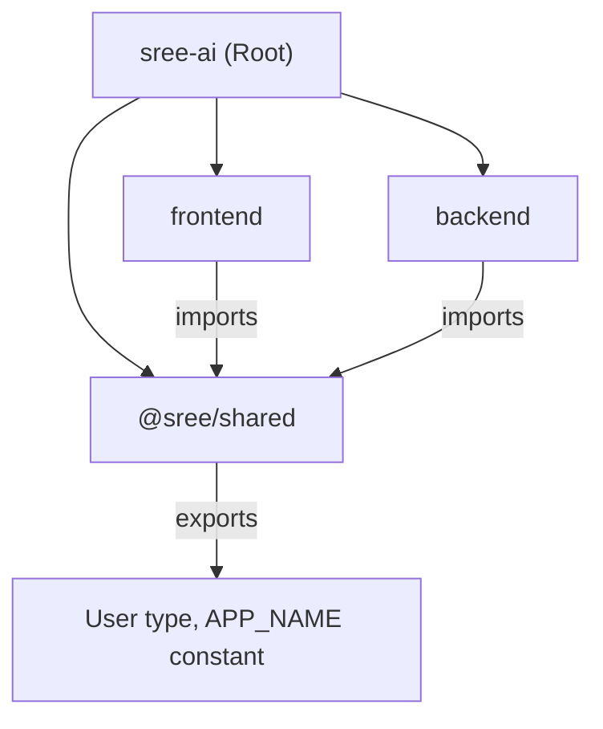

# System Architecture & Data Flow

## High-Level Architecture

---

## Backend Middleware Pipeline

Every request to `/api/*` passes through this middleware chain in order:

### Per-Route Middleware (Applied Selectively)

| Middleware | Purpose | Applied To |
|-----------|---------|-----------|
| `authMiddleware` | Requires Bearer token, attaches `req.user` + `req.userTier` | Protected routes (settings, image, video, payment) |
| `flexAuthMiddleware` | Auth optional — resolves authenticated OR anonymous identity | Chat, usage, models, feature requests |
| `anonymousIdentity` | Creates/restores anonymous identity via fingerprint + cookie | Anonymous-capable routes |
| `abuseDetectionMiddleware` | Datacenter IP detection, strict mode for suspicious requests | AI chat/generation |
| `rateLimitMiddleware(tool)` | Per-minute/daily/monthly rate limits based on tier | All AI endpoints |
| `featureGateMiddleware(feat)` | Checks if tier has feature access | Chat, image, video |
| `uploadSizeValidator` | Validates file size against tier limit | Upload endpoints |
| `uploadAgreementMiddleware` | Checks user agreed to upload policy | File upload endpoints |
| `queuePriorityMiddleware` | Sets queue priority based on tier (0-3) | AI endpoints |
| `starterPlanMiddleware` | Requires Starter or Pro tier | Video generation |
| `videoModelValidationMiddleware` | Validates allowed video model IDs | Video generation |
| `paymentRateLimit(max, window)` | In-memory sliding window limiter | Payment endpoints |

---

## Request Lifecycle

### Authenticated Request Flow

### Anonymous Request Flow

---

## AI Provider Architecture

### Provider Resolution Logic (`providerResolver.ts`)

1. **In-memory cache** — Check if model→provider is already resolved
2. **Database lookup** — Query `ai_models.provider` by `model_id`
3. **Hardcoded map** — Fallback `PROVIDER_MAP` with 80+ model→provider mappings
4. **Prefix matching** — Safety net: `gemini-*` → google, `groq/*` → groq, `nvidia/*` etc. → nvidia

### API Key Pool (`apiKeyPool.service.ts`)

Multi-key rotation with health tracking per provider:

| State | Meaning | Recovery |
|-------|---------|----------|
| `healthy` | Key is working | Used immediately |
| `cooldown` | Rate limited (429) or server error (5xx) | Auto-recovers after 10-60s |
| `dead` | Auth failure (401/403) | Never auto-recovers |

**Rotation strategy:** Round-robin per request. On error, the failing key's state is updated and the next healthy key is tried. Retry count = pool size.

---

## Data Flow: Chat Completion (Streaming)

---

## Monorepo Package Dependency Graph

The `shared` package exports:
- **Types:** `User` interface (`id, email, plan_type, requests_remaining, credits`)
- **Constants:** `APP_NAME = 'Sree AI'`
