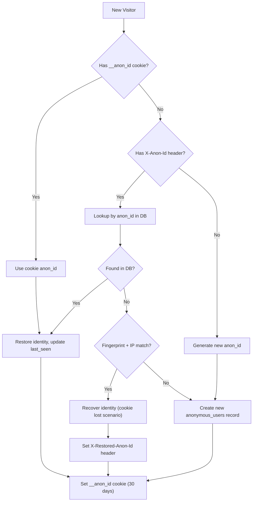
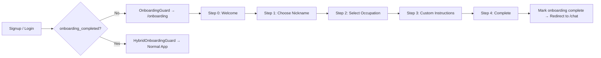
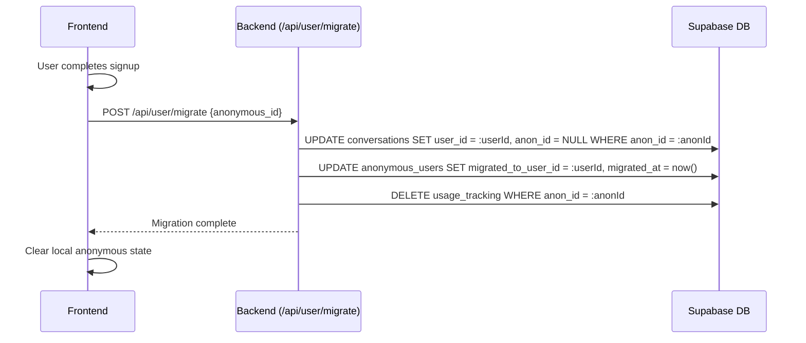

# Authentication & User Management

## Authentication Methods

Sree AI supports three identity modes:

| Mode | Method | Capabilities |
|------|--------|-------------|
| **Anonymous** | Browser fingerprint + IP hash | Limited chat (3/day, 1/min), no image/video/voice |
| **Free** | Email/password or Google OAuth | Chat (25/day), Image (3/day), Voice (5/day), 10MB uploads |
| **Paid (Starter/Pro)** | Same as Free + active subscription | Full feature access with higher limits |

---

## Supabase Auth Integration

### Frontend (`auth.store.ts`)

```
┌─────────────────────────────────────────────────┐
│ initializeAuth()                                 │
│                                                  │
│ 1. supabase.auth.getSession()                   │
│    → Loads existing session from localStorage    │
│                                                  │
│ 2. supabase.auth.onAuthStateChange(callback)    │
│    → Listens for: SIGNED_IN, SIGNED_OUT,        │
│      TOKEN_REFRESHED, INITIAL_SESSION           │
│                                                  │
│ 3. On SIGNED_IN:                                │
│    → Set user in Zustand store                  │
│    → PostHog identify(user_id, {plan, email})   │
│    → Fetch profile from /api/user/profile       │
│    → Check onboarding status                    │
│                                                  │
│ 4. On SIGNED_OUT:                               │
│    → Clear user from store                      │
│    → PostHog reset()                            │
│    → Redirect to /login                         │
│                                                  │
│ 5. On TOKEN_REFRESHED:                          │
│    → Update session token silently              │
└─────────────────────────────────────────────────┘
```

### Backend Auth Middleware (`middleware/auth.ts`)

```typescript
// authMiddleware — Strict authentication required
async (req, res, next) => {
  1. Extract Bearer token from Authorization header
  2. supabaseAdmin.auth.getUser(token) → verify JWT
  3. Fetch profile.plan_type from profiles table
  4. Resolve tier: profile.plan_type || 'free'
  5. Check BYOK: Look for active api_keys where in_use = true
  6. Attach to request:
     - req.user = { id, email, ... }
     - req.userTier = 'free' | 'starter' | 'pro'
     - req.isByok = boolean
}

// flexAuthMiddleware — Auth optional, supports anonymous
async (req, res, next) => {
  1. Try Bearer token → if valid, same as authMiddleware
  2. If no token → resolve anonymous identity:
     - Read X-Anon-Id header (localStorage UUID)
     - Read X-Fingerprint header (browser fingerprint hash)
     - Read __anon_id cookie (backup)
     - resolveAnonymousIdentity(anonId, fingerprint, ipHash)
  3. Attach to request:
     - req.anonId = resolved anonymous ID
     - req.userTier = 'anonymous'
     - req.anonymousUser = DB record
}
```

---

## Anonymous Identity System

### Flow Diagram



### Key Implementation Details

- **Fingerprint:** SHA-256 hash of browser properties (canvas, WebGL, fonts, screen, etc.)
- **IP Hash:** SHA-256 hash of client IP — raw IP is **never stored**
- **Cookie:** `__anon_id` with 30-day expiry, `SameSite=Lax`, `httpOnly=true`
- **Recovery:** If cookie is lost, the system tries to match by fingerprint hash + IP hash combo
- **Table:** `anonymous_users` (id, anon_id, fingerprint_hash, ip_hash, user_agent, country, daily counters, migration info)

---

## User Profile (profiles table)

When a user signs up, a database trigger `handle_new_user()` automatically creates a profile:

| Column | Type | Purpose |
|--------|------|---------|
| `id` | UUID (PK) | Same as `auth.users.id` |
| `display_name` | TEXT | User's display name |
| `nickname` | TEXT | Preferred short name |
| `email` | TEXT | From auth provider |
| `avatar_url` | TEXT | Supabase Storage URL |
| `occupation` | TEXT | User's role (set during onboarding) |
| `description` | TEXT | Self-description (max 500 chars) |
| `date_of_birth` | DATE | Minimum 13 years old |
| `custom_instructions` | TEXT | System prompt preferences |
| `more_about_you` | TEXT | Additional personalization context |
| `plan_type` | TEXT | `free` / `starter` / `pro` / `elite` / `business` |
| `requests_remaining` | INTEGER | Legacy request counter |
| `onboarding_completed` | BOOLEAN | Gate for onboarding guard |
| `onboarding_step` | INTEGER | Current onboarding step (0=not started, 1=profile, 2=api keys) |
| `chat_limit_daily` | INTEGER | Denormalized daily chat limit (default: 0) |
| `chat_limit_monthly` | INTEGER | Denormalized monthly chat limit |
| `voice_limit_daily` | INTEGER | Denormalized daily voice limit |
| `voice_limit_monthly` | INTEGER | Denormalized monthly voice limit |
| `image_limit_daily` | INTEGER | Denormalized daily image limit |
| `image_limit_monthly` | INTEGER | Denormalized monthly image limit |
| `upload_limit_mb` | INTEGER | Max file size per plan |
| `download_limit_hourly` | INTEGER | Hourly download limit |
| `download_limit_daily` | INTEGER | Daily download limit |
| `chat/voice/image_count_daily/monthly` | NUMERIC | Usage counters |
| `download_count_hourly` | INTEGER | Hourly download counter |
| `download_count_daily` | INTEGER | Daily download counter |
| `last_download_at` | TIMESTAMPTZ | Last download timestamp |
| `file_upload_agreed` | BOOLEAN | User accepted upload policy |
| `file_upload_agreed_at` | TIMESTAMPTZ | When policy was accepted |
| `cookie_consent` | BOOLEAN | GDPR & DPDP consent status |
| `cookie_consent_at` | TIMESTAMPTZ | When cookie consent was given/revoked |
| `tos_accepted` | BOOLEAN | Terms of Service acceptance |
| `tos_accepted_at` | TIMESTAMPTZ | When ToS was accepted |
| `privacy_accepted` | BOOLEAN | Privacy Policy acceptance |
| `privacy_accepted_at` | TIMESTAMPTZ | When Privacy Policy was accepted |
| `created_at` | TIMESTAMPTZ | Account creation time |
| `updated_at` | TIMESTAMPTZ | Last profile update |

---

## Onboarding Flow



### Route Guards

| Guard | Location | Behavior |
|-------|----------|----------|
| `OnboardingGuard` | Wraps protected routes | If `onboarding_completed = false` → redirect to `/onboarding` |
| `HybridOnboardingGuard` | Wraps hybrid routes (chat) | If authenticated + not onboarded → redirect to `/onboarding`. Anonymous users pass through. |

---

## Data Migration (Anonymous → Authenticated)

When an anonymous user signs up, their conversations and messages are migrated to their new authenticated account:



---

## Session Management

The app tracks active sessions per user device:

- **`user_sessions`** — Active sessions with `device_id`, `os`, `browser`, `ip_address`, `is_current`
- **`trusted_devices`** — Known devices that have been seen before
- **Upsert strategy** — Uses unique index on `(user_id, device_id)` to prevent duplicates
- **Revoke others** — User can terminate all other sessions from Settings

### Cookie Consent & Statutory Transparency (GDPR & DPDP Act 2023)

- Tracked via `profiles.cookie_consent` boolean and local storage token (`sree_cookie_consent`)
- `CookieConsent` banner shown on first visit with explicit links to [`/cookies`](file:///p:/antygravity-projects/Ai-Sass-3/legal/06-cookie-policy.md) and [`/privacy`](file:///p:/antygravity-projects/Ai-Sass-3/legal/01-privacy-policy.md)
- Consent synced to profile via `PATCH /api/user/profile`
- PostHog telemetry initializes strictly in compliance with cookie choices

---

## Terms of Service & Privacy Policy Consent Architecture

To comply with the Indian **DPDP Act 2023** and **IT Act Section 79** safe harbor rules:

1. **Mandatory Acceptance Checkbox**:
   - Both email/password signup and OAuth flows mandate checking the agreement to Terms of Service and Privacy Policy.
2. **Database Tracking**:
   - Recorded on the user profile:
     - `profiles.tos_accepted` (`BOOLEAN DEFAULT false`)
     - `profiles.tos_accepted_at` (`TIMESTAMPTZ`)
3. **Resilient OAuth & Email Confirmation Persistence**:
   - On OAuth initiation or pending email verification, `pending_tos_accepted: 'true'` and `pending_tos_accepted_at: ISO timestamp` are buffered in `localStorage`.
   - When the user returns from Google OAuth or email confirmation, `auth.store.ts` automatically commits the timestamp to Supabase `profiles` if not already set, eliminating race conditions or timestamp overwrites.
4. **Anonymous User Experience**:
   - Anonymous visitors receive a personalized conversational greeting (`"Bro !"` / friendly guest salutation) instead of blank greetings across the header and chat input.
