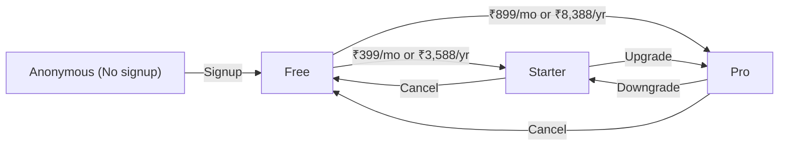
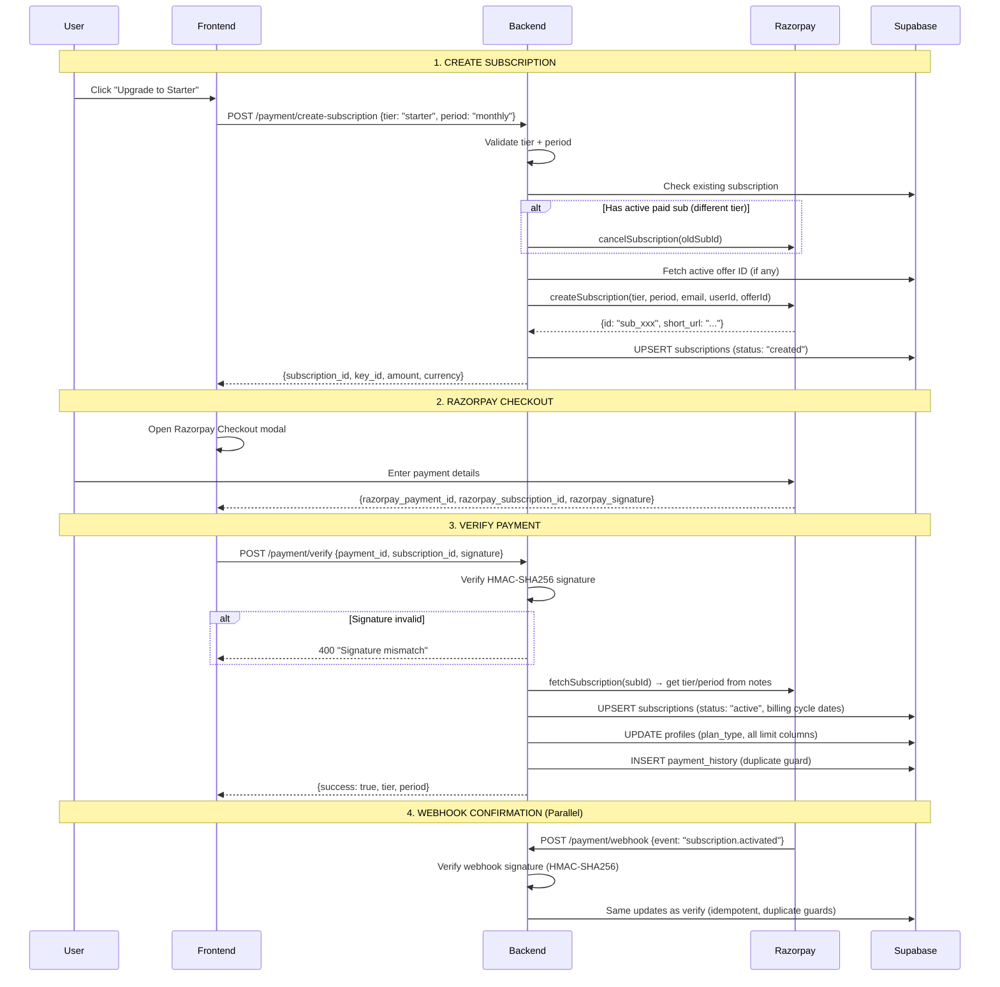
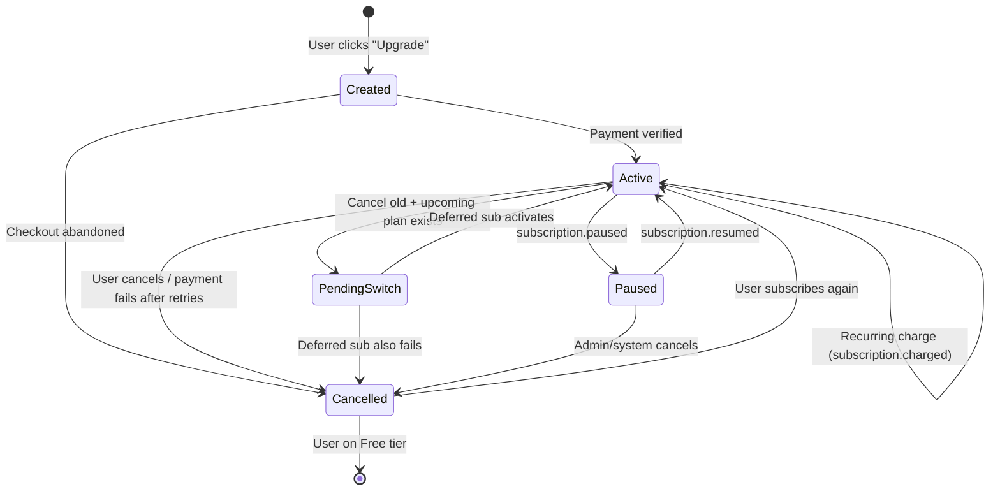
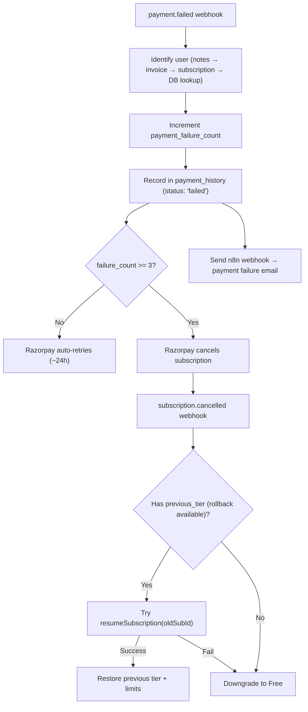

# Payment & Subscription Architecture

## Plan Tiers



### Tier Comparison

| Feature | Anonymous | Free | Starter ($8/mo) | Pro ($29/mo) |
|---------|-----------|------|-----------------|--------------|
| **Chat** | 3/day, 1/min | 25/day, 3/min | 200/day, 10/min | Unlimited, 20/min |
| **Voice** | ✗ | 5/day | 50/day | 200/day |
| **Image** | ✗ | 3/day | 30/day | 100/day |
| **Video** | ✗ | ✗ | 5/day | 25/day |
| **TTS** | ✗ | 5/day | 30/day | 100/day |
| **Download** | ✗ | 5/day | 30/day | 100/day |
| **File Upload** | ✗ | 10MB | 50MB | 250MB |
| **All Models** | ✗ | ✗ | ✓ | ✓ |
| **Custom Instructions** | ✗ | ✓ | ✓ | ✓ |
| **BYOK** | ✗ | ✗ | ✓ | ✓ |

### Pricing in INR (All amounts in paise internally)

| Tier | Monthly | Annual | Annual Savings |
|------|---------|--------|---------------|
| **Starter** | ₹399 (39,900 paise) | ₹3,588 (358,800 paise) | 25% |
| **Pro** | ₹899 (89,900 paise) | ₹8,388 (838,800 paise) | 22% |

> **Note:** All internal amounts are in **paise** (1/100 of INR). Frontend displays USD equivalents ($8/$29) for marketing, but actual billing is in INR via Razorpay.

---

## Payment Flow — Full Lifecycle



---

## Webhook Events Handled

| Event | Action |
|-------|--------|
| `subscription.activated` | Activate tier, update profile limits, record payment history, handle deferred sub activation |
| `subscription.charged` | Extend billing cycle, clear rollback info (if payment confirmed), record payment |
| `subscription.cancelled` | Smart cancellation: check if upcoming plan exists, handle deferred rollback, or downgrade to Free |
| `subscription.paused` | Mark as paused (if no upcoming plan), or log as expected (deferred switch) |
| `subscription.resumed` | Mark as active, log resume |
| `payment.failed` | Increment failure count, record in history, notify via n8n webhook (email to user) |

### Webhook Security

```
1. Read X-Razorpay-Signature header
2. HMAC-SHA256(rawBody, RAZORPAY_WEBHOOK_SECRET)
3. Compare computed signature vs received signature
4. Reject on mismatch → 400
```

---

## Subscription State Machine



---

## Plan Change Flows

### Upgrade (e.g., Free → Starter, Starter → Pro)

```
1. Frontend: POST /payment/create-subscription {tier: newTier}
2. Backend: Cancel existing subscription (if any)
3. Backend: Create new Razorpay subscription
4. User: Complete checkout
5. Backend: Verify → activate new tier immediately
```

### Deferred Plan Change (Schedule for next cycle)

```
1. Frontend: POST /payment/schedule-change {new_tier, new_period}
2. Backend: Mark current sub → cancel_at_cycle_end = true
3. Backend: Create deferred subscription (starts at cycle end)
4. Backend: Save upcoming_tier, upcoming_period, upcoming_razorpay_sub_id
5. Razorpay: At cycle end, cancels old sub → activates new sub
6. Webhook: subscription.cancelled (old) + subscription.activated (new) → switch tier
```

### Activate Now (Skip waiting for cycle end)

```
1. Frontend: POST /payment/activate-now
2. Backend: Create new subscription (immediate)
3. Backend: Save as pending_activation_sub_id
4. User: Complete checkout
5. Backend on verify:
   → Cancel old active subscription
   → Cancel deferred upcoming subscription
   → Activate new tier immediately
```

### Downgrade / Cancel

```
1. Frontend: POST /payment/cancel
2. Backend: cancelSubscriptionAtCycleEnd(subId)
3. Backend: Set upcoming_tier = 'free', cancel_at_cycle_end = true
4. User keeps current tier until billing cycle ends
5. Webhook: subscription.cancelled → downgrade to Free, reset limits
```

---

## Payment Failure Handling



### n8n Payment Failure Notification

The webhook payload sent to n8n includes:
- User name + email
- Plan name + price
- Payment method + last 4 digits
- Failure reason
- Retry attempt number (of 3)
- Next retry date
- Downgrade date (3-day grace period)
- Links: billing settings, update payment method, dashboard, support

---

## Razorpay Service Layer (`razorpay.service.ts`)

### Exported Functions

| Function | Purpose |
|----------|---------|
| `createSubscription(tier, period, email, userId, offerId?)` | Create new subscription with plan notes |
| `createDeferredSubscription(tier, period, email, userId, startAt)` | Create subscription starting at future date |
| `cancelSubscription(subId)` | Immediately cancel a subscription |
| `cancelSubscriptionAtCycleEnd(subId)` | Cancel at end of current billing period |
| `pauseSubscription(subId)` | Pause subscription (not available for UPI) |
| `resumeSubscription(subId)` | Resume a paused subscription |
| `fetchSubscription(subId)` | Get subscription details from Razorpay |
| `fetchInvoice(invoiceId)` | Get invoice details for payment failure lookup |
| `verifyPaymentSignature(paymentId, subId, signature)` | HMAC-SHA256 signature verification |
| `verifyWebhookSignature(body, signature)` | Webhook signature verification |
| `syncAllPlans()` | Sync plans on Razorpay (called at server startup) |
| `getKeyId()` | Get Razorpay Key ID for frontend checkout |

### Razorpay Offers

Active offers (discounts) can be configured per tier via `app_config` table:
- Key: `razorpay_offer_id_starter` or `razorpay_offer_id_pro`
- Value: Razorpay Offer ID
- Passed to subscription creation for automatic discount application

---

## Frontend Payment API (`paymentService`)

| Method | Endpoint | Purpose |
|--------|----------|---------|
| `createSubscription(tier, period)` | `POST /payment/create-subscription` | Start checkout flow |
| `verifyPayment(data)` | `POST /payment/verify` | Confirm payment after checkout |
| `getStatus()` | `GET /payment/status` | Current subscription + upcoming plan info |
| `cancelSubscription()` | `POST /payment/cancel` | Cancel at cycle end |
| `scheduleChange(tier, period)` | `POST /payment/schedule-change` | Schedule plan change for next cycle |
| `activateNow()` | `POST /payment/activate-now` | Skip deferred, activate immediately |
| `cancelUpcoming()` | `POST /payment/cancel-upcoming` | Cancel a scheduled plan change |

---

## Database Tables for Payment

### `subscriptions` table

| Column | Purpose |
|--------|---------|
| `user_id` | FK to auth.users (UNIQUE — 1 sub per user) |
| `tier` | Current tier: free / starter / pro |
| `status` | created / active / cancelled / paused / pending_switch |
| `plan_id` | plan_starter_monthly / plan_pro_annually, etc. |
| `razorpay_subscription_id` | Razorpay sub ID |
| `razorpay_payment_id` | Latest payment ID |
| `billing_period` | monthly / annually |
| `billing_cycle_start/end` | Current billing period dates |
| `cancel_at_cycle_end` | Will cancel when period ends |
| `upcoming_tier/period/razorpay_sub_id/start_date` | Scheduled plan change |
| `pending_activation_sub_id` | "Activate now" sub waiting for checkout |
| `previous_tier/period/razorpay_sub_id` | Rollback info for failed deferred switches |
| `payment_failure_count` | Current consecutive failure count |
| `last_payment_failure_at` | Timestamp of last failure |

### `payment_history` table

| Column | Purpose |
|--------|---------|
| `razorpay_payment_id` | UNIQUE — prevents duplicate records |
| `razorpay_subscription_id` | Associated subscription |
| `amount` | Amount in paise |
| `currency` | INR |
| `status` | captured / failed |
| `tier` | Plan tier at time of payment |
| `billing_period` | monthly / annually |
| `retry_count` | For failed payments, which retry attempt |
