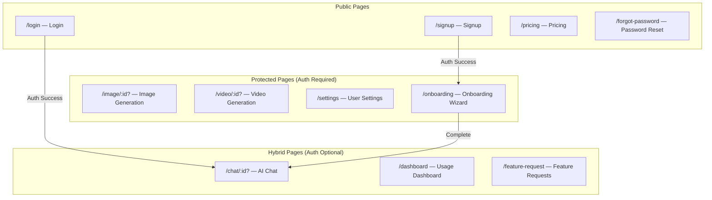
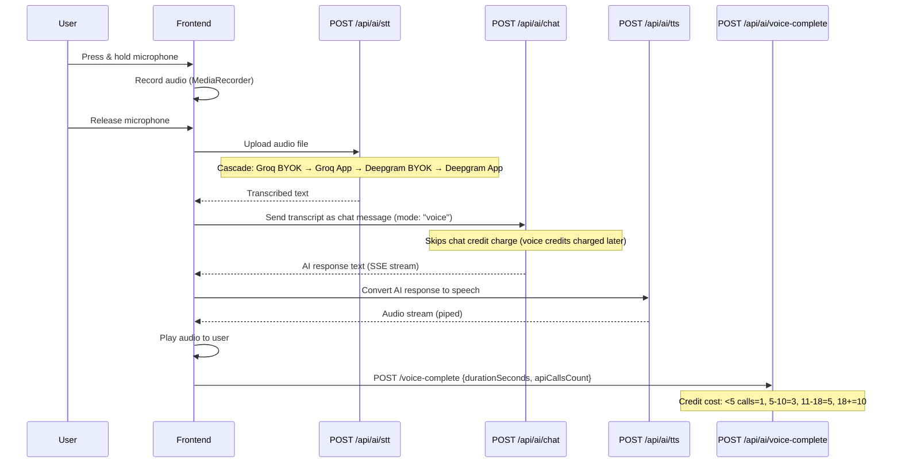

# Features & Page Map

## Application Pages



---

## Page Details

### 1. Chat (`/chat/:id?`)

| Aspect | Detail |
|--------|--------|
| **Auth** | Hybrid — works for anonymous + authenticated users |
| **Route Guard** | `HybridOnboardingGuard` |
| **Middleware** | `flexAuth → abuseDetection → queuePriority → featureGate('basicChat') → rateLimit('chat')` |
| **Features** | Multi-model AI chat, SSE streaming, file upload (docs, images, audio, video), voice mode (STT → Chat → TTS), code highlighting, markdown rendering, conversation history, model selector, thinking animation |
| **Models** | 80+ models from NVIDIA NIM, Google Gemini, Groq |
| **Attachments** | Documents (PDF, DOCX, XLSX, CSV, TXT), Images (PNG, JPG, GIF), Audio (WebM, MP3, WAV), Video (MP4, WebM) |
| **Multimodal** | Document text extraction, audio transcription, video frame extraction (FFmpeg → R2 → vision content) |
| **Video Recall** | References to previously uploaded videos are automatically re-processed |
| **Store** | `chat.store.ts` (conversations, messages, active model, streaming state) |

### 2. Image Generation (`/image/:id?`)

| Aspect | Detail |
|--------|--------|
| **Auth** | Required (authMiddleware) |
| **Middleware** | `flexAuth → abuseDetection → queuePriority → featureGate('imageGeneration') → rateLimit('image')` |
| **Features** | Text-to-image generation, image-to-image editing (Kontext), prompt input, negative prompt, seed control, resolution/dimension selection, image gallery (history), lightbox preview, download |
| **Models** | NVIDIA: FLUX-1-dev, FLUX-1-schnell, FLUX-1-kontext-dev, FLUX-2-klein-4b, Stable Diffusion XL, SD 3.5 Large. Google: Gemini Image models |
| **Image Storage** | Generated images → Base64 → R2 upload → `user_images` table |
| **Kontext Mode** | Image editing: user uploads reference image + prompt → model edits the image |
| **Store** | `image.store.ts` (gallery, active image, generation params) |

### 3. Video Generation (`/video/:id?`)

| Aspect | Detail |
|--------|--------|
| **Auth** | Required (Starter+ plan) |
| **Middleware** | `auth → starterPlan → videoModelValidation → abuseDetection → queuePriority → featureGate('videoGeneration') → rateLimit('video')` |
| **Features** | Text-to-video generation, image-to-video (reference file upload), configurable resolution (720p/1080p), aspect ratio, duration (5-8s), video gallery, playback, download |
| **Models** | Google Veo 3.1 (`veo-3.1-generate`), Gemini Omni Flash (Pro only unless BYOK) |
| **Video Storage** | Generated buffer → R2 upload → `user_videos` table |
| **Batch Generation** | Up to 5 reference files processed in parallel |
| **Store** | `video.store.ts` (gallery, active video, generation params) |

### 4. Dashboard (`/dashboard`)

| Aspect | Detail |
|--------|--------|
| **Auth** | Hybrid |
| **Features** | Usage overview (chat, voice, image, video credits used/remaining), daily/monthly counters, plan info, upgrade prompts |
| **Data Source** | `GET /api/ai/usage` → comprehensive usage status from `usage_tracking` table |

### 5. Settings (`/settings`)

| Aspect | Detail |
|--------|--------|
| **Auth** | Required |
| **Tabs** | Profile, API Keys, Sessions, Billing |
| **Profile** | Display name, nickname, occupation, custom instructions, avatar upload/remove, password change |
| **API Keys** | BYOK management: add/toggle/delete keys for NVIDIA, Google, Deepgram, Groq with provider validation |
| **Sessions** | View active sessions, trusted devices, revoke other sessions, delete trusted devices |
| **Billing** | Current plan, subscription status, upcoming plan changes, cancel/change/activate-now, payment history |
| **Account** | Delete account (cascading cleanup) |

### 6. Pricing (`/pricing`)

| Aspect | Detail |
|--------|--------|
| **Auth** | Public |
| **Features** | Plan comparison table, monthly/annual toggle, upgrade buttons, Razorpay checkout integration |
| **Plans** | Free, Starter ($8/₹399), Pro ($29/₹899) |

### 7. Onboarding (`/onboarding`)

| Aspect | Detail |
|--------|--------|
| **Auth** | Required (pre-onboarding gate) |
| **Steps** | 0: Welcome → 1: Nickname → 2: Occupation → 3: Custom Instructions → 4: Complete |
| **Store** | `onboarding.store.ts` |
| **Completion** | Sets `has_completed_onboarding = true`, redirects to `/chat` |

### 8. Feature Request (`/feature-request`)

| Aspect | Detail |
|--------|--------|
| **Auth** | Hybrid |
| **Features** | Submit feature requests (title, category, priority, description, use case, reference URL), view own requests, public roadmap, voting |
| **Categories** | 9 categories (New AI Model, Performance, UI/UX, Chat, Image, Video, Integration, Mobile App, General Idea) |
| **Webhook** | Submissions forwarded to n8n webhook for roadmap automation |
| **Status Tracking** | Raised → In Progress → Resolved → Rejected |

### 9. Login (`/login`) & Signup (`/signup`)

| Aspect | Detail |
|--------|--------|
| **Auth** | Public |
| **Methods** | Email/password, Google OAuth |
| **Post-Login** | Redirect to `/chat` (if onboarded) or `/onboarding` (if not) |
| **Post-Signup** | Trigger anonymous→auth data migration, redirect to onboarding |

### 10. Forgot Password (`/forgot-password`)

| Aspect | Detail |
|--------|--------|
| **Auth** | Public |
| **Flow** | Email → Supabase reset link → Password update |

---

## Core AI Features

### Voice Mode (Full Duplex)



### STT Provider Cascade

```
1. Groq BYOK (whisper-large-v3)
2. Groq BYOK (whisper-large-v3-turbo)  ← fallback
3. Groq App Key (whisper-large-v3)
4. Groq App Key (whisper-large-v3-turbo) ← fallback
5. Deepgram BYOK
6. Deepgram App Key                      ← final fallback
```

### File Upload & Processing

| File Type | Frontend Extraction | Backend Extraction | Max Size |
|-----------|--------------------|--------------------|----------|
| PDF | `pdfjs-dist` | `pdf-parse` | 10-250MB (by tier) |
| DOCX | `mammoth` | `mammoth` | 10-250MB |
| XLSX/CSV | `xlsx` | `xlsx` | 10-250MB |
| TXT/Code | Direct read | Direct read | 10-250MB |
| Images | Display inline | Vision content parts | 10-250MB |
| Audio | — | Deepgram transcription | 10-250MB |
| Video | — | FFmpeg frame extraction → R2 → vision | 10-250MB |

### Token Management (`TokenManager`)

- `compressMessages()` — Compresses chat history to fit context window
- `truncateDocumentText(text, limit)` — Truncates document context to 100K chars
- Uses `tiktoken` for accurate token counting
