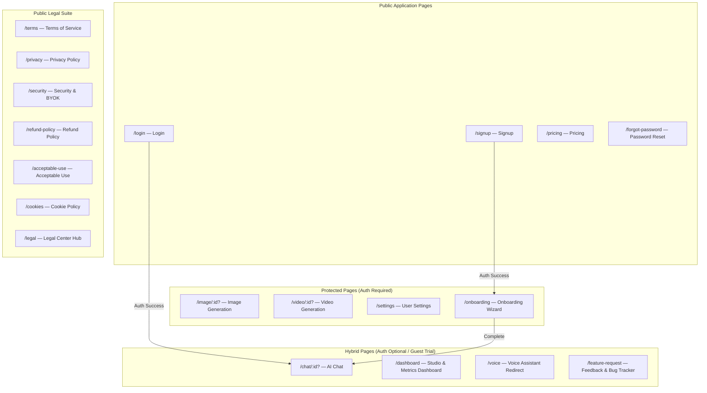
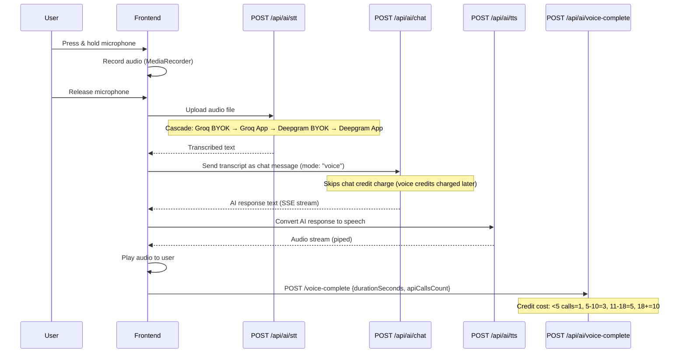

# Features & Page Map

## Application Pages



---

## Page Details

### 1. Chat (`/chat/:id?`)

| Aspect | Detail |
|--------|--------|
| **Auth** | Hybrid — works for anonymous + authenticated users |
| **Route Guard** | `HybridOnboardingGuard` |
| **Middleware** | `flexAuth → abuseDetection → queuePriority → featureGate('basicChat') → rateLimit('chat')` |
| **Features** | Multi-model AI chat, SSE streaming, file upload (max 10 attachments per prompt), voice mode (STT → Chat → TTS), code highlighting, markdown rendering, conversation history, model selector, thinking animation |
| **Models** | 85+ models from NVIDIA NIM, Google Gemini, Groq (default: `groq/compound-mini` for instant latency) |
| **Attachments** | Documents (PDF, DOCX, XLSX, CSV, TXT), Images (PNG, JPG, GIF), Audio (WebM, MP3, WAV), Video (MP4, WebM) — max 10 files per prompt enforced in UI & client validation |
| **Upload Agreement** | Mandatory policy modal (`UploadAgreementModal`) detailing external AI model inference transmission and Indian IT Act Sec 79 compliance |
| **Multimodal** | Document text extraction, audio transcription, video frame extraction (FFmpeg → R2 → vision content) |
| **Video Recall** | References to previously uploaded videos are automatically re-processed |
| **Store** | `chat.store.ts` (conversations, messages, active model, streaming state) |

### 2. Image Generation (`/image/:id?`)

| Aspect | Detail |
|--------|--------|
| **Auth** | Required (authMiddleware) |
| **Middleware** | `flexAuth → abuseDetection → queuePriority → featureGate('imageGeneration') → rateLimit('image')` |
| **Features** | Text-to-image generation, image-to-image editing (Kontext), prompt input, negative prompt, seed control, resolution presets, gallery history, lightbox preview, download |
| **Default Model** | Prioritizes **FLUX.2 klein** (`flux-2-klein-4b` / `FLUX.2-klein`) as default high-speed studio model |
| **State Persistence** | Complete generator state (selected model, prompt, aspect ratio, steps, seed) persists in `localStorage` across page reloads |
| **Models** | NVIDIA: FLUX.2 klein, FLUX.1 dev/schnell/kontext, SDXL, SD 3.5 Large. Google: Gemini Image models |
| **Image Storage** | Generated images → Base64 → R2 upload → `user_images` table |
| **Store** | `image.store.ts` (gallery, active image, generation params, localStorage sync) |

### 3. Video Generation (`/video/:id?`)

| Aspect | Detail |
|--------|--------|
| **Auth** | Required (Starter+ plan) |
| **Middleware** | `auth → starterPlan → videoModelValidation → abuseDetection → queuePriority → featureGate('videoGeneration') → rateLimit('video')` |
| **Features** | Text-to-video generation, image-to-video (reference file upload), configurable resolution (720p/1080p), aspect ratio, duration (5-8s), video gallery, playback, download |
| **Models** | Google Veo 3.1 (`veo-3.1-generate`), Gemini Omni Flash (Pro only unless BYOK) |
| **Video Storage** | Generated buffer → R2 upload → `user_videos` table |
| **Batch Generation** | Up to 5 reference files processed in parallel |
| **Store** | `video.store.ts` (gallery, active video, generation params) |

### 4. Dashboard (`/dashboard`)

| Aspect | Detail |
|--------|--------|
| **Auth** | Hybrid (`HybridOnboardingGuard` allows anonymous guest usage overview) |
| **Overhaul Features** | Complete responsive redesign with 2-tier mobile quick actions (Chat, Voice, Image, Video), compact status bar, studio feature cards, glassmorphism micro-tool badges, and smart prompt truncation |
| **Metrics Overview** | Usage overview (chat, voice, image, video credits used/remaining), daily/monthly counters, plan tier info, upgrade prompts |
| **Data Source** | `GET /api/ai/usage` → comprehensive usage status from `usage_tracking` table |

### 5. Settings (`/settings`)

| Aspect | Detail |
|--------|--------|
| **Auth** | Required |
| **Tabs** | Profile, API Keys, Sessions, Billing |
| **Profile** | Display name, nickname, occupation, custom instructions, avatar upload/remove, password change |
| **API Keys** | BYOK management: add/toggle/delete keys for NVIDIA, Google, Deepgram, Groq with provider validation |
| **Sessions** | View active sessions, trusted devices, revoke other sessions, delete trusted devices |
| **Billing** | Current plan, subscription status, upcoming plan changes, cancel/change/activate-now, payment history |
| **Account** | Delete account (cascading cleanup) |

### 6. Pricing (`/pricing`)

| Aspect | Detail |
|--------|--------|
| **Auth** | Public |
| **Features** | Plan comparison table, monthly/annual toggle, upgrade buttons, Razorpay checkout integration |
| **Plans** | Free, Starter ($8/₹399), Pro ($29/₹899) |

### 7. Onboarding (`/onboarding`)

| Aspect | Detail |
|--------|--------|
| **Auth** | Required (pre-onboarding gate) |
| **Steps** | 0: Welcome → 1: Nickname → 2: Occupation → 3: Custom Instructions → 4: Complete |
| **Store** | `onboarding.store.ts` |
| **Completion** | Sets `onboarding_completed = true`, redirects to `/chat` |

### 8. Feature Request (`/feature-request`)

| Aspect | Detail |
|--------|--------|
| **Auth** | Hybrid |
| **Features** | Submit feature requests & bug reports, category-aware dynamic form, screenshot upload, view own requests, public roadmap, status tracking |
| **Categories** | 10 categories: New AI Model, Performance, UI/UX, Chat, Image & Video Gen, Voice & Audio, Speed & Latency, Integration / API, Mobile App, Other Vision. Plus **Bug / Glitch** (triggers special form fields) |
| **Bug Report Mode** | When category `bug_report` is selected: hides "Real-World Use Case", shows "Steps to Reproduce" textarea and "Attach a Screenshot (Optional)" dropzone |
| **Screenshot Upload** | Drag-and-drop / file picker → `POST /api/feature-requests/upload-screenshot` → Cloudflare R2 bucket `feature-request` → public URL `https://frss.sreeai.qzz.io/<file>`. Accepted: PNG, JPG, WebP, GIF, AVIF up to 10 MB |
| **Screenshot Rate Limit** | In-memory sliding window: 1 upload per 5 min, 10 per hour, 10 per day (keyed on user ID / anon ID / IP) |
| **Storage** | Bug report data (`steps_to_reproduce`, `screenshot_url`) stored in `client_metadata` JSONB column. Extracted at query time by `getUserRequests()` and `getPublicRoadmap()` |
| **Webhook** | Submissions forwarded to n8n webhook with `request_type: "BugReport"` or `"FeatureRequest"` and event `bug_report_submitted` or `feature_request_submitted` |
| **Status Tracking** | Raised → In Progress → Resolved → Rejected |
| **R2 Bucket** | `feature-request` with custom domain `frss.sreeai.qzz.io` |

### 9. Login (`/login`) & Signup (`/signup`)

| Aspect | Detail |
|--------|--------|
| **Auth** | Public |
| **Methods** | Email/password, Google OAuth |
| **Post-Login** | Redirect to `/chat` (if onboarded) or `/onboarding` (if not) |
| **Post-Signup** | Trigger anonymous→auth data migration, redirect to onboarding |

### 10. Forgot Password (`/forgot-password`)

| Aspect | Detail |
|--------|--------|
| **Auth** | Public |
| **Flow** | Email → Supabase reset link → Password update |

### 11. Legal & Statutory Compliance Suite (`/terms`, `/privacy`, etc.)

| Aspect | Detail |
|--------|--------|
| **Auth** | Public (accessible to guest visitors, logged-in users, and search crawlers) |
| **Architecture** | Wrapped in unified `LegalLayout` with animated top drawer triggered on Sree AI brand logo click, responsive breadcrumbs, and next/prev doc cards |
| **Routes** | `/terms` (Terms of Service), `/privacy` (Privacy Policy), `/security` (Security & BYOK Policy), `/refund-policy` (Refund & Cancellation Policy), `/acceptable-use` (Acceptable Use Policy), `/cookies` (Cookie Policy), `/legal` & `/legal-center` (Legal Hub) |
| **Statutory Standards** | Compliant with the Indian **DPDP Act 2023**, **IT Act 2000 (Section 79 Intermediary Safe Harbor)**, **GDPR**, and **CCPA/CPRA** |

### 12. SEO & AEO (Answer Engine Optimization) Engine

| File / Component | Purpose | Details |
|------------------|---------|---------|
| **`/robots.txt`** | Crawler Access Rules | Allows standard search crawlers (`Googlebot`, `Bingbot`, etc.) and explicitly welcomes AI answer engines (`GPTBot`, `PerplexityBot`, `ClaudeBot`, `Applebot`) while disallowing private routes (`/api/`, `/settings`, `/onboarding`) |
| **`/sitemap.xml`** | Search Index Mapping | 15 dynamic canonical URLs covering public AI modalities, pricing, community feature requests, and the complete statutory legal suite |
| **`/llms.txt`** | AI Agent Concise Spec | Markdown specification providing LLM agents (ChatGPT Search, Perplexity, Claude Web) with core architecture, models, pricing tiers, and legal links |
| **`/llms-full.txt`** | Comprehensive LLM Context | Exhaustive architectural breakdown, quota rules, and policy text in a single agent-readable context file |
| **Schema.org / JSON-LD** | Rich Snippets | Embedded in `index.html` as `SoftwareApplication` and `Organization` entities with feature list, operating system, and pricing offers |

---

## Core AI Features

### Voice Mode (Full Duplex)



### STT Provider Cascade

```
1. Groq BYOK (whisper-large-v3)
2. Groq BYOK (whisper-large-v3-turbo)  ← fallback
3. Groq App Key (whisper-large-v3)
4. Groq App Key (whisper-large-v3-turbo) ← fallback
5. Deepgram BYOK
6. Deepgram App Key                      ← final fallback
```

### File Upload & Processing

| File Type | Frontend Extraction | Backend Extraction | Max Size |
|-----------|--------------------|--------------------|----------|
| PDF | `pdfjs-dist` | `pdf-parse` | 10-250MB (by tier) |
| DOCX | `mammoth` | `mammoth` | 10-250MB |
| XLSX/CSV | `xlsx` | `xlsx` | 10-250MB |
| TXT/Code | Direct read | Direct read | 10-250MB |
| Images | Display inline | Vision content parts | 10-250MB |
| Audio | — | Deepgram transcription | 10-250MB |
| Video | — | FFmpeg frame extraction → R2 → vision | 10-250MB |

### Token Management (`TokenManager`)

- `compressMessages()` — Compresses chat history to fit context window
- `truncateDocumentText(text, limit)` — Truncates document context to 100K chars
- Uses `tiktoken` for accurate token counting
