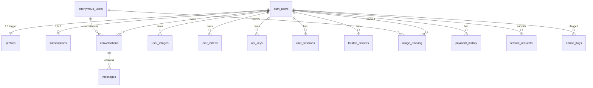

# Database Schema — Complete Reference

## Overview

Database: **Supabase (PostgreSQL)** with Row Level Security (RLS) enabled on all user-facing tables.



---

## Core Tables

### `profiles`

> Auto-created via `handle_new_user()` trigger when a user signs up.

| Column | Type | Default | Constraint | Description |
|--------|------|---------|-----------|-------------|
| `id` | UUID | — | PK, FK → auth.users | Same as auth user ID |
| `email` | TEXT | — | — | From auth provider |
| `display_name` | TEXT | — | — | Display name |
| `nickname` | TEXT | — | — | Preferred short name |
| `avatar_url` | TEXT | — | — | Supabase Storage URL |
| `occupation` | TEXT | — | — | Set during onboarding |
| `custom_instructions` | TEXT | — | — | System prompt preferences |
| `more_about_you` | TEXT | — | — | Additional personalization |
| `plan_type` | TEXT | `'free'` | — | `free` / `starter` / `pro` |
| `has_completed_onboarding` | BOOLEAN | `false` | — | Onboarding gate |
| `onboarding_step` | INTEGER | `0` | — | Current step (0-4) |
| `chat_limit_daily` | INTEGER | `25` | — | Denormalized from plan |
| `chat_limit_monthly` | INTEGER | `750` | — | Denormalized from plan |
| `voice_limit_daily` | INTEGER | `5` | — | Denormalized from plan |
| `voice_limit_monthly` | INTEGER | `150` | — | Denormalized from plan |
| `image_limit_daily` | INTEGER | `3` | — | Denormalized from plan |
| `image_limit_monthly` | INTEGER | `90` | — | Denormalized from plan |
| `upload_limit_mb` | INTEGER | `10` | — | Max file size (10/50/250 by tier) |
| `file_upload_agreed` | BOOLEAN | `false` | — | Upload policy acceptance |
| `file_upload_agreed_at` | TIMESTAMPTZ | — | — | When policy was accepted |
| `cookie_consent` | BOOLEAN | — | — | GDPR consent status |
| `created_at` | TIMESTAMPTZ | `now()` | — | Account creation |
| `updated_at` | TIMESTAMPTZ | `now()` | — | Last update |

**RLS Policies:**
- Users can view, update, insert their own profile (`auth.uid() = id`)
- Service role has full access

**Trigger:**
```sql
CREATE FUNCTION handle_new_user() RETURNS trigger AS $$
BEGIN
  INSERT INTO public.profiles (id, email)
  VALUES (new.id, new.raw_user_meta_data->>'email');
  RETURN new;
END;
$$ LANGUAGE plpgsql SECURITY DEFINER;

CREATE TRIGGER on_auth_user_created
  AFTER INSERT ON auth.users
  FOR EACH ROW EXECUTE FUNCTION handle_new_user();
```

---

### `subscriptions`

> One subscription per user (UNIQUE on `user_id`).

| Column | Type | Default | Description |
|--------|------|---------|-------------|
| `id` | UUID | `uuid_generate_v4()` | PK |
| `user_id` | UUID | — | FK → auth.users, UNIQUE |
| `plan_id` | TEXT | — | e.g., `plan_starter_monthly` |
| `razorpay_subscription_id` | TEXT | — | Razorpay sub ID |
| `razorpay_plan_id` | TEXT | — | Razorpay plan ID |
| `razorpay_payment_id` | TEXT | — | Latest payment ID |
| `status` | TEXT | — | `created` / `active` / `cancelled` / `paused` / `pending_switch` |
| `tier` | TEXT | `'free'` | Current tier |
| `billing_period` | TEXT | — | `monthly` / `annually` |
| `billing_cycle_start` | TIMESTAMPTZ | — | Period start |
| `billing_cycle_end` | TIMESTAMPTZ | — | Period end |
| `current_period_end` | TIMESTAMPTZ | — | Alias for cycle end |
| `amount_paid` | INTEGER | — | Amount in paise |
| `currency` | TEXT | `'INR'` | Currency code |
| `cancel_at_cycle_end` | BOOLEAN | `false` | Will cancel at end |
| `cancelled_at` | TIMESTAMPTZ | — | When cancelled |
| `upcoming_tier` | TEXT | — | Scheduled plan change tier |
| `upcoming_period` | TEXT | — | Scheduled plan change period |
| `upcoming_razorpay_sub_id` | TEXT | — | Deferred subscription ID |
| `upcoming_start_date` | TIMESTAMPTZ | — | When deferred sub starts |
| `pending_activation_sub_id` | TEXT | — | "Activate now" sub waiting for checkout |
| `previous_tier` | TEXT | — | Rollback info for failed deferred switches |
| `previous_period` | TEXT | — | Rollback info |
| `previous_razorpay_sub_id` | TEXT | — | Rollback info |
| `payment_failure_count` | INTEGER | `0` | Consecutive failure count |
| `last_payment_failure_at` | TIMESTAMPTZ | — | Last failure timestamp |
| `created_at` | TIMESTAMPTZ | `now()` | Record creation |

---

### `payment_history`

| Column | Type | Default | Description |
|--------|------|---------|-------------|
| `id` | UUID | `gen_random_uuid()` | PK |
| `user_id` | UUID | — | FK → auth.users |
| `razorpay_payment_id` | TEXT | — | UNIQUE (duplicate guard) |
| `razorpay_subscription_id` | TEXT | — | Associated subscription |
| `amount` | INTEGER | — | Amount in paise |
| `currency` | TEXT | `'INR'` | Currency |
| `status` | TEXT | — | `captured` / `failed` |
| `tier` | TEXT | — | Plan tier at time of payment |
| `billing_period` | TEXT | — | `monthly` / `annually` |
| `retry_count` | INTEGER | — | For failed payments |
| `created_at` | TIMESTAMPTZ | `now()` | Payment timestamp |

---

### `conversations`

| Column | Type | Default | Description |
|--------|------|---------|-------------|
| `id` | UUID | `uuid_generate_v4()` | PK |
| `user_id` | UUID | — | FK → auth.users (nullable for anon) |
| `anon_id` | TEXT | — | Anonymous user identifier |
| `title` | TEXT | `'New Chat'` | Conversation title |
| `model` | TEXT | — | Last used model |
| `videos_in_conversation` | JSONB | `'[]'` | Stored video references `[{name, url}]` |
| `created_at` | TIMESTAMPTZ | `now()` | Creation time |
| `updated_at` | TIMESTAMPTZ | `now()` | Last message time |

**RLS Policies:**
- Users can CRUD conversations where `auth.uid() = user_id` OR `anon_id` matches `X-Anon-Id` header
- Service role has full access

---

### `messages`

| Column | Type | Default | Description |
|--------|------|---------|-------------|
| `id` | UUID | `uuid_generate_v4()` | PK |
| `conversation_id` | UUID | — | FK → conversations |
| `role` | TEXT | — | `user` / `assistant` / `system` |
| `content` | TEXT or JSONB | — | Message text or multimodal content array |
| `metadata` | JSONB | — | Attachments, extracted context, thinking data |
| `created_at` | TIMESTAMPTZ | `now()` | Message timestamp |

**RLS:** Inherited from conversations (policy checks conversation ownership).

---

### `anonymous_users`

| Column | Type | Default | Description |
|--------|------|---------|-------------|
| `id` | UUID | `uuid_generate_v4()` | PK |
| `anon_id` | TEXT | — | UNIQUE, client-generated UUID |
| `fingerprint_hash` | TEXT | — | SHA-256 of browser fingerprint |
| `ip_hash` | TEXT | — | SHA-256 of IP address |
| `user_agent` | TEXT | — | Browser user agent |
| `country` | TEXT | — | Geo-resolved country |
| `daily_chat_count` | INTEGER | `0` | Legacy daily counter |
| `daily_voice_count` | INTEGER | `0` | Legacy daily counter |
| `request_minute_count` | INTEGER | `0` | Per-minute counter |
| `last_request_at` | TIMESTAMPTZ | — | Last request time |
| `last_daily_reset` | TIMESTAMPTZ | `now()` | Last daily reset |
| `last_seen_at` | TIMESTAMPTZ | `now()` | Last activity |
| `migrated_to_user_id` | UUID | — | FK → auth.users (on signup) |
| `migrated_at` | TIMESTAMPTZ | — | Migration timestamp |
| `created_at` | TIMESTAMPTZ | `now()` | First visit |

**Indexes:** `anon_id`, `fingerprint_hash`, `ip_hash`, `(fingerprint_hash, ip_hash)`

---

### `usage_tracking`

> Unified rate limiting for all tools, both authenticated and anonymous users.

| Column | Type | Default | Description |
|--------|------|---------|-------------|
| `id` | UUID | `uuid_generate_v4()` | PK |
| `user_id` | UUID | — | FK → auth.users (nullable) |
| `anon_id` | TEXT | — | Anonymous user ID (nullable) |
| `tool_type` | TEXT | — | CHECK: `chat`, `voice`, `image`, `file_upload`, `download`, `tts`, `stt`, `video` |
| `minute_count` | INTEGER | `0` | Per-minute counter |
| `last_minute_reset` | TIMESTAMPTZ | `now()` | Last minute reset |
| `daily_count` | INTEGER | `0` | Daily counter |
| `last_daily_reset` | TIMESTAMPTZ | `now()` | Last daily reset |
| `monthly_count` | INTEGER | `0` | Monthly counter |
| `last_monthly_reset` | TIMESTAMPTZ | `now()` | Last monthly reset |
| `is_byok` | BOOLEAN | `false` | Whether last request used BYOK |
| `created_at` | TIMESTAMPTZ | `now()` | Record creation |
| `updated_at` | TIMESTAMPTZ | `now()` | Last update |

**Constraints:**
- `CHECK: (user_id IS NOT NULL AND anon_id IS NULL) OR (user_id IS NULL AND anon_id IS NOT NULL)`
- `UNIQUE (user_id, tool_type)`
- `UNIQUE (anon_id, tool_type)`

---

### `api_keys`

| Column | Type | Default | Description |
|--------|------|---------|-------------|
| `id` | UUID | `gen_random_uuid()` | PK |
| `user_id` | UUID | — | FK → auth.users |
| `provider` | TEXT | — | `nvidia` / `google` / `deepgram` / `groq` |
| `encrypted_key` | TEXT | — | AES-encrypted API key |
| `name` | TEXT | — | User-defined label |
| `in_use` | BOOLEAN | `true` | Whether key is active |
| `created_at` | TIMESTAMPTZ | `now()` | Creation time |

---

### `ai_models`

> AI model registry — controls what models appear in the frontend model selector.

| Column | Type | Description |
|--------|------|-------------|
| `id` | UUID | PK |
| `model_id` | TEXT | Unique model identifier (e.g., `deepseek-ai/deepseek-v3.2`) |
| `name` | TEXT | Display name |
| `provider` | TEXT | `nvidia` / `google` / `groq` |
| `category` | TEXT | `chat` / `image` / `video` |
| `tier_required` | TEXT | `free` / `starter` / `pro` |
| `is_active` | BOOLEAN | Whether model is available |
| `description` | TEXT | Model description |
| `capabilities` | JSONB | Supported features |
| `created_at` | TIMESTAMPTZ | Registration time |

---

### `user_images`

| Column | Type | Description |
|--------|------|-------------|
| `id` | UUID | PK |
| `user_id` | UUID | FK → auth.users |
| `url` | TEXT | R2 URL |
| `prompt` | TEXT | Generation prompt |
| `model` | TEXT | Model used |
| `seed` | INTEGER | Random seed |
| `width` | INTEGER | Image width |
| `height` | INTEGER | Image height |
| `created_at` | TIMESTAMPTZ | Generation time |

---

### `user_videos`

| Column | Type | Description |
|--------|------|-------------|
| `id` | UUID | PK |
| `user_id` | UUID | FK → auth.users |
| `url` | TEXT | R2 URL |
| `prompt` | TEXT | Generation prompt |
| `model` | TEXT | Model used |
| `duration` | INTEGER | Duration in seconds |
| `aspect_ratio` | TEXT | e.g., `16:9` |
| `resolution` | TEXT | e.g., `720p` |
| `created_at` | TIMESTAMPTZ | Generation time |

---

### `user_sessions`

| Column | Type | Description |
|--------|------|-------------|
| `id` | UUID | PK |
| `user_id` | UUID | FK → auth.users |
| `device_id` | TEXT | Client-generated device fingerprint |
| `os` | TEXT | Operating system |
| `browser` | TEXT | Browser name |
| `location` | TEXT | Geo location |
| `ip_address` | TEXT | Client IP |
| `is_current` | BOOLEAN | Currently active session |
| `last_active` | TIMESTAMPTZ | Last activity |
| `created_at` | TIMESTAMPTZ | Session creation |

**Unique Index:** `(user_id, device_id)` — prevents duplicate sessions per device

---

### `trusted_devices`

| Column | Type | Description |
|--------|------|-------------|
| `id` | UUID | PK |
| `user_id` | UUID | FK → auth.users |
| `device_id` | TEXT | Client device fingerprint |
| `os` | TEXT | Operating system |
| `browser` | TEXT | Browser name |
| `last_seen_at` | TIMESTAMPTZ | Last activity |
| `created_at` | TIMESTAMPTZ | First seen |

**Unique Index:** `(user_id, device_id)`

---

### `feature_requests`

| Column | Type | Default | Description |
|--------|------|---------|-------------|
| `id` | UUID | `gen_random_uuid()` | PK |
| `ticket_id` | TEXT | — | UNIQUE, human-readable ID (e.g., `FR-12345`) |
| `user_id` | UUID | — | FK → auth.users (nullable) |
| `anon_id` | TEXT | — | Anonymous submitter |
| `title` | TEXT | — | Request title (min 4 chars) |
| `category` | TEXT | — | Category code |
| `category_label` | TEXT | — | Human-readable category |
| `priority` | TEXT | `'helpful'` | User-set priority |
| `description` | TEXT | — | Full description (min 10 chars) |
| `use_case` | TEXT | — | Use case explanation |
| `reference_url` | TEXT | — | Reference link |
| `user_name` | TEXT | — | Submitter name |
| `user_email` | TEXT | — | Submitter email |
| `user_plan` | TEXT | `'free'` | Submitter's plan tier |
| `status` | TEXT | `'Raised'` | CHECK: `Raised`, `In Progress`, `Resolved`, `Rejected` |
| `admin_notes` | TEXT | — | Admin/internal notes |
| `notify_on_update` | BOOLEAN | `true` | Email on status change |
| `client_metadata` | JSONB | `'{}'` | Additional client data |
| `created_at` | TIMESTAMPTZ | `now()` | Submission time |
| `updated_at` | TIMESTAMPTZ | `now()` | Last update |

---

### `app_config`

> Key-value store for runtime application configuration.

| Column | Type | Description |
|--------|------|-------------|
| `key` | TEXT | PK, config key name |
| `value` | TEXT | Config value |

**Known Keys:**
- `razorpay_offer_id_starter` — Active Razorpay offer for Starter tier
- `razorpay_offer_id_pro` — Active Razorpay offer for Pro tier
- `video_byok_only_banner` — Flag for "BYOK only" video banner

---

### `abuse_flags`

| Column | Type | Description |
|--------|------|-------------|
| `id` | UUID | PK |
| `identifier` | TEXT | User ID or anon_id |
| `flag_type` | TEXT | Type of abuse detected |
| `details` | JSONB | Metadata about the abuse |
| `created_at` | TIMESTAMPTZ | When flagged |

---

## RPC Functions

### `increment_multi_usage`

> Atomic multi-tool usage increment with automatic period resets.

```sql
-- Called by usage.service.ts for atomic rate limit checking + incrementing
-- Parameters: identity (user_id or anon_id), tool_type, increment amount, is_byok
-- Returns: updated counts after increment
-- Auto-resets: minute (60s), daily (24h), monthly (30d) counters
```

### `increment_usage_and_return`

> Single-tool atomic increment with limit checking.

### `sync_profile_usage_counts`

> Syncs denormalized limit columns in profiles table with current plan config.

---

## Migration History (25 files)

| # | File | Description |
|---|------|-------------|
| 1 | `20240416000000_initial_schema.sql` | Core tables: profiles, subscriptions, conversations, messages, user_images |
| 2+ | Various | Added: anonymous_users, usage_tracking, api_keys, ai_models, user_videos, user_sessions, trusted_devices, feature_requests, payment_history, abuse_flags, app_config |
| Latest | `20260816_*` | Recent schema additions and modifications |

**Key migration milestones:**
- **Phase 6** (`20260512000001`): Subscription & rate limiting system (anonymous_users, usage_tracking tables)
- **Phase 10** (`20260514000001`): Anonymous conversations (anon_id on conversations, updated RLS policies)
- **Feature Requests** (`20260814200000`): feature_requests table with ticket system
