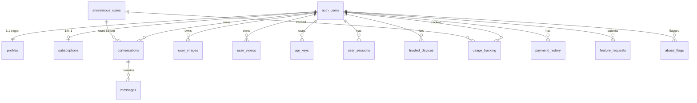

# Database Schema — Complete Reference

> **Last verified:** 2026-09-09 against live Supabase production instance.
> **Source of truth:** `full-schema.sql` in this directory (verified against `pg_catalog`).

## Overview

Database: **Supabase (PostgreSQL)** with Row Level Security (RLS) enabled on **all 17 tables**.



---

## Core Tables

### `profiles`

> Auto-created via `handle_new_user()` trigger when a user signs up.

| Column | Type | Default | Nullable | Constraint | Description |
|--------|------|---------|:--------:|-----------|-------------|
| `id` | UUID | — | NO | PK, FK → auth.users ON DELETE CASCADE | Same as auth user ID |
| `email` | TEXT | — | NO | UNIQUE | From auth provider |
| `display_name` | TEXT | — | YES | — | Display name |
| `nickname` | TEXT | — | YES | — | Preferred short name |
| `avatar_url` | TEXT | — | YES | — | Profile image URL |
| `occupation` | TEXT | — | YES | — | Set during onboarding |
| `description` | TEXT | — | YES | — | Self-description, max 500 chars |
| `date_of_birth` | DATE | — | YES | — | Minimum 13 years old |
| `custom_instructions` | TEXT | — | YES | — | System prompt preferences |
| `more_about_you` | TEXT | — | YES | — | Additional personalization |
| `plan_type` | TEXT | `'free'` | YES | CHECK: `free`, `starter`, `pro`, `elite`, `business` | Current plan tier |
| `requests_remaining` | INTEGER | `10` | YES | — | Legacy request counter |
| `onboarding_completed` | BOOLEAN | `false` | NO | — | Whether onboarding is done |
| `onboarding_step` | INTEGER | `0` | NO | — | Current step (0=not started, 1=profile, 2=api keys) |
| `chat_limit_daily` | INTEGER | `0` | YES | — | Daily chat limit (0 = managed by backend) |
| `chat_limit_monthly` | INTEGER | `0` | YES | — | Monthly chat limit |
| `voice_limit_daily` | INTEGER | `0` | YES | — | Daily voice limit |
| `voice_limit_monthly` | INTEGER | `0` | YES | — | Monthly voice limit |
| `image_limit_daily` | INTEGER | `0` | YES | — | Daily image limit |
| `image_limit_monthly` | INTEGER | `0` | YES | — | Monthly image limit |
| `upload_limit_mb` | INTEGER | `10` | YES | — | Max file size (10/50/250 by tier) |
| `download_limit_hourly` | INTEGER | `10` | YES | — | Hourly download limit |
| `download_limit_daily` | INTEGER | `50` | YES | — | Daily download limit |
| `chat_count_daily` | NUMERIC | `0` | YES | — | Daily chat usage counter |
| `chat_count_monthly` | NUMERIC | `0` | YES | — | Monthly chat usage counter |
| `voice_count_daily` | NUMERIC | `0` | YES | — | Daily voice usage counter |
| `voice_count_monthly` | NUMERIC | `0` | YES | — | Monthly voice usage counter |
| `image_count_daily` | NUMERIC | `0` | YES | — | Daily image usage counter |
| `image_count_monthly` | NUMERIC | `0` | YES | — | Monthly image usage counter |
| `download_count_hourly` | INTEGER | `0` | YES | — | Hourly download counter |
| `download_count_daily` | INTEGER | `0` | YES | — | Daily download counter |
| `last_download_at` | TIMESTAMPTZ | `now()` | YES | — | Last download timestamp |
| `file_upload_agreed` | BOOLEAN | `false` | NO | — | Upload policy acceptance |
| `file_upload_agreed_at` | TIMESTAMPTZ | — | YES | — | When policy was accepted |
| `cookie_consent` | BOOLEAN | `false` | NO | — | GDPR & DPDP cookie consent |
| `cookie_consent_at` | TIMESTAMPTZ | — | YES | — | When cookie consent was given/revoked |
| `tos_accepted` | BOOLEAN | `false` | NO | — | Terms of Service acceptance |
| `tos_accepted_at` | TIMESTAMPTZ | — | YES | — | When ToS was accepted |
| `privacy_accepted` | BOOLEAN | `false` | NO | — | Privacy Policy acceptance |
| `privacy_accepted_at` | TIMESTAMPTZ | — | YES | — | When Privacy Policy was accepted |
| `created_at` | TIMESTAMPTZ | `now()` | NO | — | Account creation |
| `updated_at` | TIMESTAMPTZ | `now()` | NO | — | Last update |

**RLS Policies (2):**
- `Users can view their own profile.` — SELECT WHERE `auth.uid() = id`
- `Users can update their own profile.` — UPDATE WHERE `auth.uid() = id`

**Trigger:**
```sql
CREATE FUNCTION handle_new_user() RETURNS trigger AS $$
BEGIN
  INSERT INTO public.profiles (id, email)
  VALUES (new.id, new.raw_user_meta_data->>'email');
  RETURN new;
END;
$$ LANGUAGE plpgsql SECURITY DEFINER;

CREATE TRIGGER on_auth_user_created
  AFTER INSERT ON auth.users
  FOR EACH ROW EXECUTE FUNCTION handle_new_user();
```

---

### `subscriptions`

> One subscription per user (UNIQUE on `user_id`).

| Column | Type | Default | Nullable | Description |
|--------|------|---------|:--------:|-------------|
| `id` | UUID | `gen_random_uuid()` | NO | PK |
| `user_id` | UUID | — | NO | FK → auth.users ON DELETE CASCADE, UNIQUE |
| `plan_id` | TEXT | — | NO | e.g., `plan_starter_monthly` |
| `status` | TEXT | — | NO | `created` / `active` / `cancelled` / `paused` / `pending_switch` |
| `razorpay_subscription_id` | TEXT | — | YES | Razorpay sub ID |
| `razorpay_plan_id` | TEXT | — | YES | Razorpay plan ID |
| `razorpay_payment_id` | TEXT | — | YES | Latest payment ID |
| `tier` | TEXT | `'free'` | YES | Current tier: free / starter / pro / elite |
| `billing_period` | TEXT | `'monthly'` | YES | CHECK: `monthly`, `annually` |
| `billing_cycle_start` | TIMESTAMPTZ | — | YES | Period start |
| `billing_cycle_end` | TIMESTAMPTZ | — | YES | Period end |
| `current_period_end` | TIMESTAMPTZ | — | YES | Alias for cycle end |
| `amount_paid` | INTEGER | `0` | YES | Amount in paise |
| `currency` | TEXT | `'INR'` | YES | Currency code |
| `cancel_at_cycle_end` | BOOLEAN | `false` | YES | Will cancel at end |
| `cancelled_at` | TIMESTAMPTZ | — | YES | When cancelled |
| `upcoming_tier` | TEXT | — | YES | CHECK: NULL or `free`/`starter`/`pro` |
| `upcoming_period` | TEXT | — | YES | CHECK: NULL or `monthly`/`annually` |
| `upcoming_razorpay_sub_id` | TEXT | — | YES | Deferred subscription ID |
| `upcoming_start_date` | TIMESTAMPTZ | — | YES | When deferred sub starts |
| `pending_activation_sub_id` | TEXT | — | YES | "Activate now" sub waiting for checkout |
| `previous_tier` | TEXT | — | YES | CHECK: NULL or `free`/`starter`/`pro` — rollback info |
| `previous_period` | TEXT | — | YES | CHECK: NULL or `monthly`/`annually` — rollback info |
| `previous_razorpay_sub_id` | TEXT | — | YES | Rollback Razorpay sub ID |
| `payment_failure_count` | INTEGER | `0` | NO | Consecutive failure count |
| `last_payment_failure_at` | TIMESTAMPTZ | — | YES | Last failure timestamp |
| `created_at` | TIMESTAMPTZ | `now()` | NO | Record creation |

**RLS Policies (2):**
- `Users can read own subscription` — SELECT WHERE `auth.uid() = user_id`
- `Users can view their own subscriptions.` — SELECT WHERE `auth.uid() = user_id`

---

### `payment_history`

| Column | Type | Default | Nullable | Description |
|--------|------|---------|:--------:|-------------|
| `id` | UUID | `gen_random_uuid()` | NO | PK |
| `user_id` | UUID | — | YES | FK → auth.users ON DELETE CASCADE |
| `razorpay_payment_id` | TEXT | — | YES | Razorpay payment ID |
| `razorpay_order_id` | TEXT | — | YES | Razorpay order ID |
| `razorpay_subscription_id` | TEXT | — | YES | Associated subscription |
| `amount` | INTEGER | `0` | NO | Amount in paise |
| `currency` | TEXT | `'INR'` | NO | Currency |
| `status` | TEXT | `'created'` | NO | CHECK: `created`, `authorized`, `captured`, `failed`, `refunded` |
| `method` | TEXT | — | YES | Payment method |
| `tier` | TEXT | — | YES | Plan tier at time of payment |
| `billing_period` | TEXT | — | YES | `monthly` / `annually` |
| `notes` | JSONB | `'{}'` | YES | Additional payment metadata |
| `retry_count` | INTEGER | `0` | YES | Payment attempt number (0=first) |
| `created_at` | TIMESTAMPTZ | `now()` | NO | Payment timestamp |

**Indexes:** `user_id`, `razorpay_payment_id`, UNIQUE on `razorpay_payment_id` WHERE NOT NULL

**RLS Policies (2):**
- `Users can read own payment history` — SELECT WHERE `auth.uid() = user_id`
- `Service role manages payment history` — ALL WHERE `true` (service_role check via `auth.role()`)

---

### `conversations`

| Column | Type | Default | Nullable | Description |
|--------|------|---------|:--------:|-------------|
| `id` | UUID | `uuid_generate_v4()` | NO | PK |
| `user_id` | UUID | — | YES | FK → auth.users ON DELETE CASCADE |
| `anon_id` | TEXT | — | YES | Anonymous user identifier |
| `title` | TEXT | — | NO | Conversation title |
| `type` | TEXT | `'chat'` | YES | CHECK: `chat`, `voice` |
| `videos_in_conversation` | JSONB | `'[]'` | YES | Stored video references `[{name, url}]` |
| `created_at` | TIMESTAMPTZ | `now()` | YES | Creation time |
| `updated_at` | TIMESTAMPTZ | `now()` | YES | Last message time |

**Indexes:** `anon_id`

**RLS Policies (5):**
- `Users can view own conversations` — SELECT WHERE `auth.uid() = user_id` OR `anon_id` matches `X-Anon-Id` header
- `Users can create own conversations` — INSERT (same ownership check)
- `Users can update own conversations` — UPDATE (same ownership check)
- `Users can delete own conversations` — DELETE (same ownership check)
- `Service role full access to conversations` — ALL WHERE `auth.role() = 'service_role'`

---

### `messages`

| Column | Type | Default | Nullable | Description |
|--------|------|---------|:--------:|-------------|
| `id` | UUID | `uuid_generate_v4()` | NO | PK |
| `conversation_id` | UUID | — | NO | FK → conversations ON DELETE CASCADE |
| `role` | TEXT | — | NO | CHECK: `user`, `assistant`, `system` |
| `content` | TEXT | — | NO | Message text |
| `metadata` | JSONB | `'{}'` | YES | Attachments, extracted context, thinking data |
| `created_at` | TIMESTAMPTZ | `now()` | YES | Message timestamp |

**RLS Policies (5):** Inherited from conversations — all 4 user policies check conversation ownership via a subquery, plus service_role full access.

---

### `anonymous_users`

| Column | Type | Default | Nullable | Description |
|--------|------|---------|:--------:|-------------|
| `id` | UUID | `uuid_generate_v4()` | NO | PK |
| `anon_id` | TEXT | — | NO | UNIQUE, client-generated UUID |
| `fingerprint_hash` | TEXT | — | NO | SHA-256 of browser fingerprint |
| `ip_hash` | TEXT | — | NO | SHA-256 of IP address |
| `user_agent` | TEXT | — | YES | Browser user agent |
| `country` | TEXT | — | YES | Geo-resolved country |
| `daily_chat_count` | INTEGER | `0` | YES | Legacy daily chat counter |
| `daily_voice_count` | INTEGER | `0` | YES | Legacy daily voice counter |
| `request_minute_count` | INTEGER | `0` | YES | Per-minute counter |
| `last_request_at` | TIMESTAMPTZ | — | YES | Last request time |
| `last_seen_at` | TIMESTAMPTZ | `now()` | YES | Last activity |
| `migrated_to_user_id` | UUID | — | YES | FK → auth.users (on signup) |
| `migrated_at` | TIMESTAMPTZ | — | YES | Migration timestamp |
| `cookie_consent` | BOOLEAN | `false` | NO | GDPR & DPDP cookie consent |
| `cookie_consent_at` | TIMESTAMPTZ | — | YES | When cookie consent was given/revoked |
| `created_at` | TIMESTAMPTZ | `now()` | YES | First visit |

**Indexes:** `anon_id` (+ UNIQUE), `fingerprint_hash`, `ip_hash`, `(fingerprint_hash, ip_hash)`

**RLS Policies (1):**
- `Service role full access on anonymous_users` — ALL WHERE `auth.role() = 'service_role'`

---

### `usage_tracking`

> Unified rate limiting for all tools, both authenticated and anonymous users.

| Column | Type | Default | Nullable | Description |
|--------|------|---------|:--------:|-------------|
| `id` | UUID | `uuid_generate_v4()` | NO | PK |
| `user_id` | UUID | — | YES | FK → auth.users |
| `anon_id` | TEXT | — | YES | Anonymous user ID |
| `tool_type` | TEXT | — | NO | CHECK: `chat`, `voice`, `image`, `file_upload`, `download`, `tts`, `stt`, `video` |
| `minute_count` | NUMERIC | `0` | YES | Per-minute counter |
| `last_minute_reset` | TIMESTAMPTZ | `now()` | YES | Last minute reset |
| `daily_count` | NUMERIC | `0` | YES | Daily counter |
| `last_daily_reset` | TIMESTAMPTZ | `now()` | YES | Last daily reset |
| `monthly_count` | NUMERIC | `0` | YES | Monthly counter |
| `last_monthly_reset` | TIMESTAMPTZ | `now()` | YES | Last monthly reset |
| `total_count` | INTEGER | `0` | YES | Lifetime total counter |
| `is_byok` | BOOLEAN | `false` | YES | Whether last request used BYOK |
| `created_at` | TIMESTAMPTZ | `now()` | YES | Record creation |
| `updated_at` | TIMESTAMPTZ | `now()` | YES | Last update |

**Constraints:**
- `UNIQUE (user_id, tool_type)`
- `UNIQUE (anon_id, tool_type)`

**Indexes:** `user_id` (WHERE NOT NULL), `anon_id` (WHERE NOT NULL), `tool_type`

**RLS Policies (2):**
- `Service role full access on usage_tracking` — ALL WHERE `auth.role() = 'service_role'`
- `Users can read own usage` — SELECT WHERE `auth.uid() = user_id`

---

### `api_keys`

| Column | Type | Default | Nullable | Description |
|--------|------|---------|:--------:|-------------|
| `id` | UUID | `gen_random_uuid()` | NO | PK |
| `user_id` | UUID | — | NO | FK → auth.users |
| `provider` | TEXT | — | NO | `nvidia` / `google` / `deepgram` / `groq` |
| `encrypted_key` | TEXT | — | NO | AES-encrypted API key |
| `iv` | TEXT | — | NO | Initialization vector for AES |
| `name` | TEXT | — | YES | User-defined label |
| `in_use` | BOOLEAN | `true` | YES | Whether key is active |
| `created_at` | TIMESTAMPTZ | `now()` | NO | Creation time |
| `updated_at` | TIMESTAMPTZ | `now()` | YES | Last update |
| `last_used_at` | TIMESTAMPTZ | `now()` | YES | Last usage timestamp |

**RLS Policies (1):**
- `Users can manage their own API keys.` — ALL WHERE `auth.uid() = user_id`

---

### `ai_models`

> AI model registry — controls what models appear in the frontend model selector.

| Column | Type | Default | Nullable | Description |
|--------|------|---------|:--------:|-------------|
| `id` | UUID | `gen_random_uuid()` | NO | PK |
| `name` | TEXT | — | NO | Display name |
| `model_id` | TEXT | — | NO | UNIQUE model identifier (e.g., `deepseek-ai/deepseek-r1`) |
| `provider` | TEXT | `'nvidia'` | YES | `nvidia` / `google` / `groq` |
| `tier_required` | TEXT | `'free'` | YES | CHECK: `free`, `starter`, `pro`, `elite` |
| `description` | TEXT | — | YES | Model description |
| `is_vision` | BOOLEAN | `false` | YES | Can process images |
| `is_fast` | BOOLEAN | `false` | YES | Optimized for speed |
| `is_new` | BOOLEAN | `false` | YES | "New" badge in UI |
| `is_image` | BOOLEAN | `false` | YES | Image generation model |
| `is_video` | BOOLEAN | `false` | YES | Video generation model |
| `in_maintenance` | BOOLEAN | `false` | YES | Temporarily unavailable |
| `max_tokens` | INTEGER | `4096` | YES | Max output tokens |
| `context_window` | INTEGER | — | YES | Max input context |
| `img_no_can_process` | INTEGER | — | YES | Max images per request |
| `created_at` | TIMESTAMPTZ | `now()` | YES | Registration time |

**RLS Policies (1):**
- `Allow read for all authenticated users` — SELECT WHERE `true` (role: authenticated)

---

### `user_images`

| Column | Type | Default | Nullable | Description |
|--------|------|---------|:--------:|-------------|
| `id` | UUID | `uuid_generate_v4()` | NO | PK |
| `user_id` | UUID | — | YES | FK → auth.users |
| `url` | TEXT | — | NO | R2 URL |
| `prompt` | TEXT | — | NO | Generation prompt |
| `model` | TEXT | — | YES | Model used |
| `seed` | BIGINT | — | YES | Random seed |
| `width` | INTEGER | — | YES | Image width |
| `height` | INTEGER | — | YES | Image height |
| `created_at` | TIMESTAMPTZ | `now()` | YES | Generation time |

**RLS Policies (3):**
- `Users can view their own images` — SELECT WHERE `auth.uid() = user_id`
- `Users can insert their own images` — INSERT WITH CHECK `auth.uid() = user_id`
- `Users can delete their own images` — DELETE WHERE `auth.uid() = user_id`

---

### `user_videos`

| Column | Type | Default | Nullable | Description |
|--------|------|---------|:--------:|-------------|
| `id` | UUID | `uuid_generate_v4()` | NO | PK |
| `user_id` | UUID | — | YES | FK → auth.users |
| `url` | TEXT | — | NO | R2 URL |
| `prompt` | TEXT | — | NO | Generation prompt |
| `model` | TEXT | — | YES | Model used |
| `duration` | NUMERIC | — | YES | Duration in seconds |
| `aspect_ratio` | TEXT | — | YES | e.g., `16:9` |
| `resolution` | TEXT | — | YES | e.g., `720p` |
| `created_at` | TIMESTAMPTZ | `now()` | YES | Generation time |

**RLS Policies (3):**
- `Users can view their own videos` — SELECT WHERE `auth.uid() = user_id`
- `Users can insert their own videos` — INSERT WITH CHECK `auth.uid() = user_id`
- `Users can delete their own videos` — DELETE WHERE `auth.uid() = user_id`

---

### `user_sessions`

| Column | Type | Default | Nullable | Description |
|--------|------|---------|:--------:|-------------|
| `id` | UUID | `gen_random_uuid()` | NO | PK |
| `user_id` | UUID | — | YES | FK → auth.users |
| `device_id` | TEXT | — | YES | Client-generated device fingerprint |
| `os` | TEXT | — | NO | Operating system |
| `browser` | TEXT | — | NO | Browser name |
| `location` | TEXT | — | YES | Geo location |
| `ip_address` | TEXT | — | YES | Client IP |
| `is_current` | BOOLEAN | `false` | YES | Currently active session |
| `last_active` | TIMESTAMPTZ | `now()` | YES | Last activity |
| `created_at` | TIMESTAMPTZ | `now()` | YES | Session creation |

**Indexes:** `device_id`, UNIQUE `(user_id, device_id)`

**RLS Policies (4):**
- `Users can view their own sessions` — SELECT WHERE `auth.uid() = user_id`
- `Users can insert their own sessions` — INSERT WITH CHECK `auth.uid() = user_id`
- `Users can update their own sessions` — UPDATE WHERE `auth.uid() = user_id`
- `Users can delete their own sessions` — DELETE WHERE `auth.uid() = user_id`

---

### `trusted_devices`

| Column | Type | Default | Nullable | Description |
|--------|------|---------|:--------:|-------------|
| `id` | UUID | `gen_random_uuid()` | NO | PK |
| `user_id` | UUID | — | NO | FK → auth.users |
| `device_id` | TEXT | — | NO | Client device fingerprint |
| `name` | TEXT | — | YES | Device name |
| `os` | TEXT | — | YES | Operating system |
| `browser` | TEXT | — | YES | Browser name |
| `last_seen_at` | TIMESTAMPTZ | `now()` | YES | Last activity |
| `created_at` | TIMESTAMPTZ | `now()` | YES | First seen |

**Indexes:** UNIQUE `(user_id, device_id)`

**RLS Policies (4):**
- `Users can view their own trusted devices` — SELECT WHERE `auth.uid() = user_id`
- `Users can insert their own trusted devices` — INSERT WITH CHECK `auth.uid() = user_id`
- `Users can update their own trusted devices` — UPDATE WHERE `auth.uid() = user_id`
- `Users can delete their own trusted devices` — DELETE WHERE `auth.uid() = user_id`

---

### `feature_requests`

> Supports both feature requests and bug reports.

| Column | Type | Default | Nullable | Description |
|--------|------|---------|:--------:|-------------|
| `id` | UUID | `gen_random_uuid()` | NO | PK |
| `ticket_id` | TEXT | — | NO | UNIQUE, human-readable ID (e.g., `SREE-REQ-YOAML`) |
| `user_id` | UUID | — | YES | FK → auth.users |
| `anon_id` | TEXT | — | YES | Anonymous submitter |
| `title` | TEXT | — | NO | Request title |
| `category` | TEXT | — | NO | Category code (e.g., `bug_report`, `ai_model`) |
| `category_label` | TEXT | — | YES | Human-readable category |
| `priority` | TEXT | `'helpful'` | NO | Priority level |
| `description` | TEXT | — | NO | Full description |
| `use_case` | TEXT | — | YES | Use case explanation |
| `steps_to_reproduce` | TEXT | — | YES | Sequential reproduction steps (bug reports) |
| `screenshot_url` | TEXT | — | YES | R2 URL of attached screenshot |
| `reference_url` | TEXT | — | YES | Reference link |
| `user_name` | TEXT | — | YES | Submitter name |
| `user_email` | TEXT | — | YES | Submitter email |
| `user_plan` | TEXT | `'free'` | YES | Submitter's plan tier |
| `status` | TEXT | `'Raised'` | NO | CHECK: `Raised`, `In Progress`, `Resolved`, `Rejected` |
| `admin_notes` | TEXT | — | YES | Internal notes |
| `notify_on_update` | BOOLEAN | `true` | YES | Email on status change |
| `client_metadata` | JSONB | `'{}'` | YES | Additional client data |
| `created_at` | TIMESTAMPTZ | `now()` | NO | Submission time |
| `updated_at` | TIMESTAMPTZ | `now()` | NO | Last update |

**Indexes:** `user_id`, `anon_id`, `ticket_id`, `status`, `created_at DESC`

**RLS Policies (3):**
- `Users can view own feature requests` — SELECT WHERE `auth.uid() = user_id` (role: authenticated)
- `Anyone can insert feature requests` — INSERT WITH CHECK `true`
- `Service role full access on feature_requests` — ALL WHERE `true` (role: service_role)

---

### `abuse_flags`

> Identity-based abuse detection. Supports anon_id, user_id, and user_email. Phase 11.

| Column | Type | Default | Nullable | Description |
|--------|------|---------|:--------:|-------------|
| `id` | UUID | `gen_random_uuid()` | NO | PK |
| `anon_id` | TEXT | — | YES | Anonymous user ID |
| `user_id` | UUID | — | YES | Authenticated user ID |
| `fingerprint_hash` | TEXT | — | YES | Browser fingerprint hash |
| `ip_hash` | TEXT | — | YES | IP address hash |
| `user_email` | TEXT | — | YES | User email for lookup |
| `flag_type` | TEXT | — | NO | Type of abuse detected |
| `severity` | INTEGER | `1` | NO | Severity level |
| `evidence` | JSONB | `'{}'` | YES | Metadata about the abuse |
| `created_at` | TIMESTAMPTZ | `now()` | YES | When flagged |
| `expires_at` | TIMESTAMPTZ | — | YES | Auto-expiry time |
| `resolved_at` | TIMESTAMPTZ | — | YES | When resolved |
| `resolved_by` | TEXT | — | YES | Who resolved it |
| `escalation_count` | INTEGER | `0` | YES | Number of escalations |

**Indexes (partial, WHERE resolved_at IS NULL):** `anon_id`, `fingerprint_hash`, `ip_hash`, `user_id`, `user_email`, `expires_at`, `flag_type`

**RLS Policies (1):**
- `service_role_only` — ALL WHERE `auth.role() = 'service_role'`

---

### `app_config`

> Key-value store for runtime application configuration.

| Column | Type | Description |
|--------|------|-------------|
| `key` | TEXT | PK, config key name |
| `value` | TEXT | Config value |

**Known Keys (7):**
- `cleanup_secret` — Secret for cleanup edge function authentication
- `supabase_url` — Project Supabase URL
- `razorpay_offer_id_starter` — Active Razorpay offer for Starter tier
- `razorpay_offer_id_pro` — Active Razorpay offer for Pro tier
- `razorpay_plan_starter_monthly` — Razorpay plan ID for Starter monthly
- `razorpay_plan_pro_monthly` — Razorpay plan ID for Pro monthly
- `video_byok_only_banner` — Flag for "BYOK only" video banner

**RLS:** Service-role only (RLS enabled, no public policies).

---

### `cleanup_logs`

| Column | Type | Default | Nullable | Description |
|--------|------|---------|:--------:|-------------|
| `id` | BIGINT | GENERATED ALWAYS AS IDENTITY | NO | PK |
| `run_id` | UUID | `gen_random_uuid()` | NO | Groups logs from same cleanup run |
| `item_type` | TEXT | — | NO | `conversation` / `image` |
| `item_id` | UUID | — | YES | Deleted item ID |
| `plan_type` | TEXT | — | YES | User's plan at deletion time |
| `age_days` | INTEGER | — | YES | Age of item at deletion |
| `title` | TEXT | — | YES | Item title/preview |
| `r2_urls` | TEXT[] | — | YES | R2 URLs for remote cleanup |
| `metadata` | JSONB | — | YES | Additional deletion metadata |
| `deleted_at` | TIMESTAMPTZ | `now()` | NO | Deletion timestamp |
| `user_email` | TEXT | — | YES | Owner's email |
| `user_or_anon_id` | TEXT | — | YES | Owner identifier |

**Indexes:** `run_id`, `deleted_at DESC`, `user_email`, `user_or_anon_id`

**RLS:** Enabled, no public policies (server-managed).

---

## RPC Functions (8)

| Function | Arguments | Returns | Security | Description |
|----------|-----------|---------|----------|-------------|
| `handle_new_user()` | — | trigger | DEFINER | Creates profile on auth.users INSERT |
| `update_updated_at_column()` | — | trigger | INVOKER | Sets `updated_at = NOW()` on row update |
| `increment_multi_usage` | `p_user_id UUID, p_anon_id TEXT, p_requests JSONB` | JSONB | DEFINER | Atomic multi-tool usage increment with auto period resets |
| `increment_usage` | `p_user_id UUID, p_anon_id TEXT, p_tool_type TEXT, p_amount NUMERIC, p_minute_limit NUMERIC, p_daily_limit NUMERIC, p_monthly_limit NUMERIC` | JSONB | INVOKER | Single-tool atomic increment with limit checking |
| `decrement_requests` | `user_id UUID` | void | DEFINER | Decrements legacy `requests_remaining` counter |
| `migrate_anonymous_data` | `p_anon_id TEXT, p_user_id UUID` | void | DEFINER | Migrates anonymous user's conversations and usage to authenticated account |
| `cleanup_expired_data()` | — | JSONB | DEFINER | Automated data cleanup — deletes expired conversations/images per plan retention policies, queues R2 object cleanup |
| `update_anonymous_cookie_consent` | `p_anon_id TEXT, p_cookie_consent BOOLEAN, p_cookie_consent_at TIMESTAMPTZ` | void | DEFINER | Updates cookie consent for non-migrated anonymous users |

**Grants:**
```sql
GRANT EXECUTE ON FUNCTION public.migrate_anonymous_data(TEXT, UUID) TO authenticated;
GRANT EXECUTE ON FUNCTION public.migrate_anonymous_data(TEXT, UUID) TO service_role;
```
