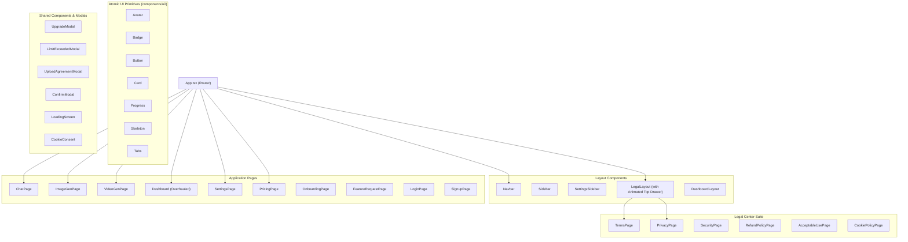

# UI/UX & Component Architecture

## Design System

### Theme

- **Mode:** Dark-first (primary background: dark navy/black)
- **Typography:** System fonts + Inter (via Tailwind defaults)
- **Color System:** Tailwind CSS 4 with custom variables
- **Animations:** Framer Motion for page transitions, micro-interactions, loading states
- **Icons:** `lucide-react` (UI icons) + `@lobehub/icons` (AI model/provider logos)

### Styling Approach

```
┌──────────────────────────────────────────────┐
│  Tailwind CSS 4           (utility classes)  │
│  CSS Modules              (*.module.css)     │  ← Scoped per component
│  Framer Motion            (animations)       │
│  Radix UI Primitives      (headless a11y)    │
│  class-variance-authority (variants)         │
└──────────────────────────────────────────────┘
```

- **Tailwind CSS 4** — Global utility classes for spacing, colors, layout
- **CSS Modules** — Component-scoped styles for complex layouts (sidebar, navbar, settings, chat)
- **Framer Motion** — Page transitions, fade-in/out, slide, scale, stagger animations
- **Radix UI** — Dialog, DropdownMenu, Switch, Tabs, Slider, Popover, Label, Slot

---

## Component Hierarchy



---

## State Management (Zustand Stores)

### 9 Stores

| Store | File | Purpose |
|-------|------|---------|
| **auth** | `auth.store.ts` | User session, profile, auth state, PostHog identification |
| **chat** | `chat.store.ts` | Conversations, messages, active model, streaming state, send/receive |
| **image** | `image.store.ts` | Image gallery, generation params, active image |
| **video** | `video.store.ts` | Video gallery, generation params, active video |
| **model** | `model.store.ts` | AI model list, selected model, model metadata |
| **usage** | `usage.store.ts` | Usage counts per tool, remaining credits, tier info |
| **ui** | `ui.store.ts` | Sidebar state, theme, loading states, modal visibility |
| **onboarding** | `onboarding.store.ts` | Onboarding step, nickname, occupation, instructions |
| **upload-agreement** | `upload-agreement.store.ts` | File upload policy agreement state |

### Store Pattern

```typescript
// All stores follow this pattern
interface StoreState {
  // State
  data: SomeType;
  loading: boolean;
  error: string | null;

  // Actions
  fetch: () => Promise<void>;
  update: (data: Partial<SomeType>) => void;
  reset: () => void;
}

export const useStore = create<StoreState>((set, get) => ({
  // ... state + actions
}));
```

---

## Layout Structure

### Desktop Layout

```
┌────────────────────────────────────────────────────────┐
│                    Navbar (top)                          │
│  Logo | Nav Links | Model Selector | User Menu          │
├──────────┬─────────────────────────────────────────────┤
│ Sidebar  │                                              │
│          │              Main Content                    │
│ (Chat    │                                              │
│  List)   │         (Chat / Image / Video)               │
│          │                                              │
│          │                                              │
│          ├──────────────────────────────────────────────┤
│          │            Chat Input / Controls              │
└──────────┴──────────────────────────────────────────────┘
```

### Navbar (`Navbar.tsx`)

- **Left:** Logo + "Sree AI" branding
- **Center:** Navigation links (Chat, Image, Video, Dashboard)
- **Right:** Model selector dropdown, user avatar/menu, theme toggle
- **Mobile:** Hamburger menu → slide-out navigation

### Sidebar (`Sidebar.tsx`)

- **Chat page:** Conversation list with search, new chat button, conversation actions (rename, delete)
- **Image page:** `ImageSidebar` — Generation controls (model, prompt, size, steps, seed)
- **Video page:** `VideoSidebar` — Generation controls (model, prompt, resolution, duration)
- **Settings page:** `SettingsSidebar` — Tab navigation (Profile, API Keys, Sessions, Billing)

---

## Key UI Components

### ChatMessage

```
┌────────────────────────────────────────────┐
│ 🤖 AI Model Name                     🕐 │
│                                            │
│ Markdown-rendered response text            │
│                                            │
│ ┌────────────────────────────────────┐    │
│ │ ```python                          │    │  ← CodeBlock with syntax
│ │ def hello():                       │    │     highlighting + copy button
│ │     print("Hello")                 │    │
│ │ ```                                │    │
│ └────────────────────────────────────┘    │
│                                            │
│ [Copy] [Read Aloud]                        │
└────────────────────────────────────────────┘
```

### ChatInput

```
┌────────────────────────────────────────────┐
│ 📎 ┌──────────────────────────────┐ 🎤 ⬆ │
│    │ Type your message...         │       │
│    └──────────────────────────────┘       │
│ [Attached: file.pdf] [img.png]            │
└────────────────────────────────────────────┘
```

- File attachment button (📎) → File picker → Upload to R2
- Voice input button (🎤) → MediaRecorder → STT → auto-send
- Send button (⬆) → Stream response
- Attachment chips showing uploaded files

### ModelSelector

```
┌──────────────────────────┐
│ Search models...          │
│ ─────────────────────────│
│ 🆕 DeepSeek V3.2    Free │
│ 🆕 Gemini 3.7 Flash Free │
│ 🔒 Llama 4 Maverick Pro  │ ← Locked models show upgrade prompt
│ 🔒 Mistral Large   Pro   │
│ ...                       │
└──────────────────────────┘
```

### Modals

| Modal | Trigger | Purpose |
|-------|---------|---------|
| `UpgradeModal` | Click on locked model or premium feature | Shows plan comparison, directs to pricing |
| `LimitExceededModal` | Rate limit hit (429 response) | Shows usage stats, reset time, upgrade option |
| `UploadAgreementModal` | First file upload attempt | Data processing agreement before uploads are allowed |
| `ConfirmModal` | Destructive actions | Generic confirmation (delete account, revoke sessions, etc.) |

---

## Animations

### Framer Motion Usage

| Animation | Component | Effect |
|-----------|-----------|--------|
| Page transitions | All pages | Fade + slide-up on mount |
| Message appear | ChatMessage | Fade-in + slight translate-y |
| Thinking dots | ThinkingAnimation | Staggered bouncing dots |
| Modal enter/exit | All modals | Scale + fade overlay |
| Sidebar toggle | Sidebar | Slide in/out from left |
| Toast | react-hot-toast | Slide from top-right |
| Loading screen | LoadingScreen | Pulse + logo animation |
| Image lightbox | ImageLightbox | Scale-up from thumbnail |

### Page Transition Pattern

```tsx
<motion.div
  initial={{ opacity: 0, y: 20 }}
  animate={{ opacity: 1, y: 0 }}
  exit={{ opacity: 0, y: -20 }}
  transition={{ duration: 0.3 }}
>
  {/* Page content */}
</motion.div>
```

---

## Responsive Design & Mobile Overhaul

- **Desktop:** Full sidebar + content layout (≥1024px)
- **Tablet:** Collapsible sidebar, stacked controls (768px-1023px)
- **Mobile (< 768px):**
  - **Top Navigation Bar:** Displays User avatar & profile badge directly on the top navbar instead of an overflowing usage pill.
  - **Sidebar Toggle Indicator:** Includes a 5-second loop animation logo indicator and a dynamic moving toggle icon to make sidebar drawer discovery effortless.
  - **2-Tier Mobile Action Bar on Dashboard:** Two stacked action rows offering instant one-tap entry to Chat, Voice, Image, and Video studios with a compact daily usage status bar.
  - **Studio Feature Cards:** Glassmorphic cards with responsive micro-tool tags and prompt truncation preventing horizontal layout breakage on small viewports.
- **Breakpoints:** Tailwind CSS 4 defaults (`sm`, `md`, `lg`, `xl`, `2xl`)

---

## Accessibility (via Radix UI)

- **Dialog/Modal:** Focus trap, ESC to close, ARIA labels
- **Dropdown Menu:** Keyboard navigation, ARIA menu roles
- **Switch:** Toggle with `role="switch"`, ARIA checked state
- **Tabs:** `role="tablist"`, keyboard left/right navigation
- **Slider:** ARIA slider with min/max/value
- **Popover:** Focus management, ESC to close

---

## Toast Notifications

Using `react-hot-toast`:

```typescript
toast.success('Profile updated');
toast.error('Failed to generate image');
toast.loading('Generating video...');
toast('Subscription activated!', { icon: '🎉' });
```

Positioned: **top-right**, auto-dismiss after 3-5 seconds.
