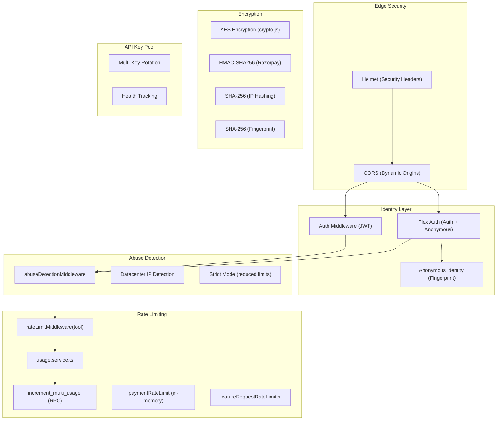
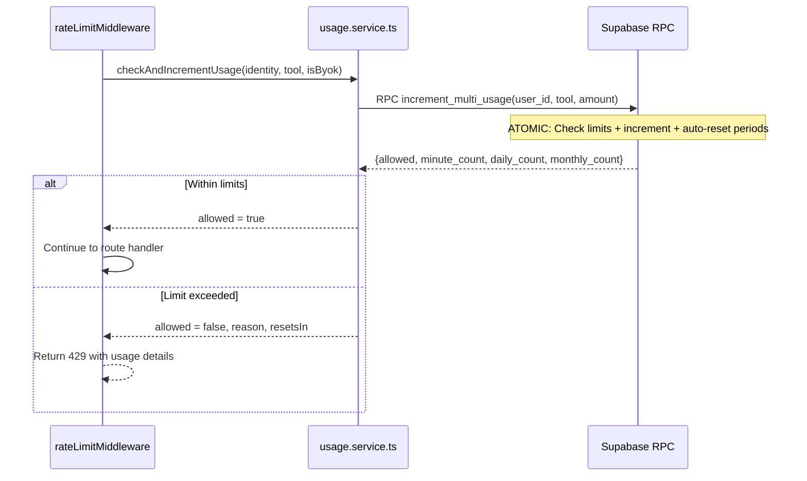
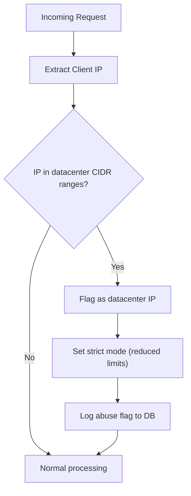
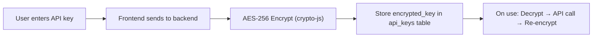
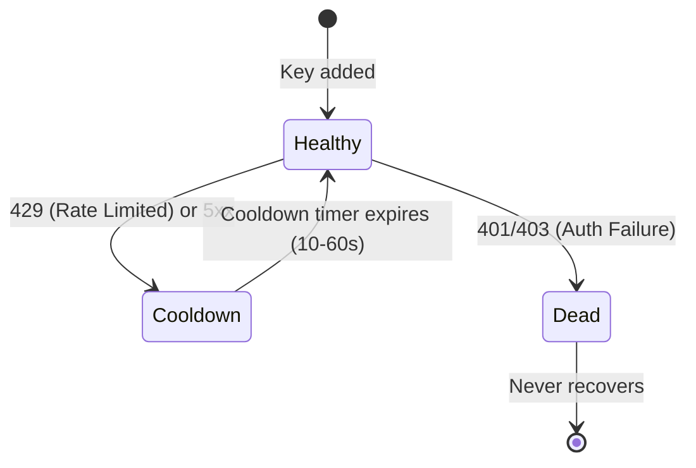

# Security & Rate Limiting Architecture

## Security Overview



---

## Middleware Security Chain

Every request passes through this pipeline:

```
Request
  → Helmet (CSP, XSS, clickjacking, HSTS headers)
  → CORS (dynamic allowlist from CORS_ORIGINS env)
  → Morgan (request logging)
  → Cookie Parser
  → JSON Body Parser (50MB limit, rawBody preserved for webhook verification)
  → Route-specific middleware:
      → authMiddleware / flexAuthMiddleware (JWT verification + tier resolution)
      → anonymousIdentity (fingerprint-based identity)
      → abuseDetectionMiddleware (datacenter IP detection)
      → rateLimitMiddleware (atomic usage tracking)
      → featureGateMiddleware (tier-based feature access)
      → uploadSizeValidator (file size by tier)
      → uploadAgreementMiddleware (policy consent check)
      → queuePriorityMiddleware (tier-based queue priority)
  → Route Handler
  → Error Handler (centralized, PostHog error capture)
```

---

## Rate Limiting Engine

### How It Works

The rate limiting system uses **atomic database operations** to prevent race conditions across concurrent requests.



### Per-Tier Limits (from `plans.ts`)

| Tool | Anonymous | Free | Starter | Pro |
|------|-----------|------|---------|-----|
| **Chat** (per minute) | 1 | 3 | 10 | 20 |
| **Chat** (daily) | 3 | 25 | 200 | Unlimited* |
| **Chat** (monthly) | 90 | 750 | 6,000 | Unlimited* |
| **Voice** (daily) | 0 | 5 | 50 | 200 |
| **Voice** (monthly) | 0 | 150 | 1,500 | 6,000 |
| **Image** (daily) | 0 | 3 | 30 | 100 |
| **Image** (monthly) | 0 | 90 | 900 | 3,000 |
| **Video** (daily) | 0 | 0 | 5 | 25 |
| **Video** (monthly) | 0 | 0 | 150 | 750 |
| **TTS** (daily) | 0 | 5 | 30 | 100 |
| **Download** (daily) | 0 | 5 | 30 | 100 |
| **File Upload** (per minute) | 0 | 3 | 5 | 10 |
| **File Size** | 0MB | 10MB | 50MB | 250MB |

> *Pro "unlimited" = `999,999` in code (effectively unlimited)

### Auto-Reset Periods

| Period | Reset Logic |
|--------|------------|
| **Per-minute** | Resets when `now - last_minute_reset > 60 seconds` |
| **Daily** | Resets when `now - last_daily_reset > 24 hours` |
| **Monthly** | Resets when `now - last_monthly_reset > 30 days` |

Resets happen **atomically inside the RPC call** — no cron jobs needed.

### BYOK Quota Multiplier

When a user uses their own API key (BYOK), usage is charged at **0.2x** the normal rate:
- 1 normal request = 1 credit
- 1 BYOK request = 0.2 credits

This effectively gives BYOK users **5x the quota**.

### 429 Response Format

```json
{
  "success": false,
  "code": "RATE_LIMIT_EXCEEDED",
  "reason": "daily",
  "tool": "chat",
  "limit": 25,
  "current": 25,
  "resetsIn": 43200,
  "message": "Daily chat limit reached. Resets in 12h.",
  "upgradeUrl": "/pricing"
}
```

---

## Abuse Detection

### `abuseDetectionMiddleware`

Detects potentially abusive requests from datacenter/proxy IPs:



### Datacenter Detection

Uses `ip-address` and `ip-cidr` libraries to check against known datacenter IP ranges:
- AWS IP ranges
- GCP IP ranges
- Azure IP ranges
- DigitalOcean, Linode, Vultr, etc.

### Strict Mode Effects

When datacenter IP is detected:
- Rate limits reduced (stricter per-minute caps)
- Request flagged in `abuse_flags` table
- Additional logging for monitoring

---

## API Key Security

### User API Keys (BYOK)



- **Encryption:** AES-256 via `crypto-js` with `ENCRYPTION_SECRET` env var
- **Storage:** Only encrypted keys stored in database
- **Decryption:** Happens at request time in `ApiKeyService`
- **Provider Validation:** Keys are validated against provider API before saving (`ProviderValidationService`)
- **Toggle:** Users can enable/disable keys without deleting
- **Multi-provider:** Supports NVIDIA, Google, Deepgram, Groq keys

### Platform API Key Pool (`apiKeyPool.service.ts`)

Multi-key rotation system for platform-provided API keys:



| State | Behavior | Recovery |
|-------|----------|----------|
| `healthy` | Used in round-robin rotation | — |
| `cooldown` | Skipped for 10-60 seconds | Auto-recovers to `healthy` |
| `dead` | Permanently removed from pool | None (requires manual fix) |

**Rotation Logic:**
1. Pick next healthy key (round-robin)
2. Attempt API call
3. On success → keep key healthy
4. On 429/5xx → mark key as `cooldown`, try next healthy key
5. On 401/403 → mark key as `dead`, try next healthy key
6. Retry up to `poolSize` times

### Key Pool Environment Variables

```
NVIDIA_API_KEY=key1,key2,key3     # Comma-separated pool
GOOGLE_API_KEY=key1,key2           # Comma-separated pool
GROQ_API_KEY=key1,key2             # Comma-separated pool
DEEPGRAM_API_KEY=key1              # Single key
```

---

## Payment Security

### Razorpay Signature Verification

```typescript
// Payment verification (client-side checkout → verify)
function verifyPaymentSignature(paymentId, subscriptionId, signature) {
  const body = paymentId + '|' + subscriptionId;
  const expected = crypto
    .createHmac('sha256', RAZORPAY_KEY_SECRET)
    .update(body)
    .digest('hex');
  return expected === signature;
}

// Webhook verification (server-to-server)
function verifyWebhookSignature(body, signature) {
  const expected = crypto
    .createHmac('sha256', RAZORPAY_WEBHOOK_SECRET)
    .update(body)
    .digest('hex');
  return expected === signature;
}
```

### Payment Rate Limits

In-memory sliding window limiter on payment endpoints:

| Endpoint | Max Requests | Window |
|----------|-------------|--------|
| `/create-subscription` | 5 | 60s |
| `/verify` | 5 | 60s |
| `/webhook` | 30 | 60s |
| `/cancel` | 3 | 60s |
| `/schedule-change` | 5 | 60s |
| `/activate-now` | 3 | 60s |
| `/cancel-upcoming` | 3 | 60s |

Cleanup runs every 2 minutes to remove expired entries.

---

## Data Privacy

### IP Address Handling

- **Raw IP is NEVER stored** in the database
- IPs are hashed with SHA-256 before any storage
- Only the hash is used for anonymous identity matching

### Fingerprint Handling

- Browser fingerprint components are hashed with SHA-256
- Only the hash is stored, original components are discarded
- Used solely for anonymous identity restoration (cookie-lost scenario)

### Cookie Consent (GDPR)

- `CookieConsent` component shown on first visit
- Consent stored in `profiles.cookie_consent`
- PostHog analytics only initialized after consent
- Essential cookies (auth, anon_id) work without consent

---

## CORS Configuration

```typescript
const allowedOrigins = (process.env.CORS_ORIGINS || '')
  .split(',')
  .map(o => o.trim())
  .filter(Boolean);

app.use(cors({
  origin: (origin, callback) => {
    if (!origin || allowedOrigins.includes(origin)) {
      callback(null, true);
    } else {
      callback(new Error('Not allowed by CORS'));
    }
  },
  credentials: true
}));
```

---

## Security Headers (Helmet)

Helmet automatically sets:
- `X-Content-Type-Options: nosniff`
- `X-Frame-Options: DENY`
- `X-XSS-Protection: 1; mode=block`
- `Strict-Transport-Security` (HSTS)
- Content Security Policy headers
- `Referrer-Policy: strict-origin-when-cross-origin`

---

## Error Handling & Monitoring

### Centralized Error Handler

```typescript
app.use((err, req, res, next) => {
  // Log error details
  console.error(`[Error] ${req.method} ${req.path}:`, err.message);

  // Capture in PostHog for error tracking
  posthog.captureException(err, userId, {
    source: 'error_handler',
    endpoint: `${req.method} ${req.originalUrl}`,
    status_code: err.status || 500,
  });

  res.status(err.status || 500).json({
    success: false,
    message: err.message || 'Internal Server Error',
  });
});
```

### PostHog Error Tracking

All caught exceptions in AI routes, payment routes, and the global error handler are reported to PostHog with:
- User ID (or anonymous ID)
- Source (e.g., `ai_stream`, `image_generation`, `video_generation`)
- Model name
- Endpoint
- Status code

---

## Environment Variables (Security-Critical)

| Variable | Purpose |
|----------|---------|
| `SUPABASE_SERVICE_ROLE_KEY` | Backend-only, bypasses RLS |
| `RAZORPAY_KEY_SECRET` | Payment signature verification |
| `RAZORPAY_WEBHOOK_SECRET` | Webhook signature verification |
| `ENCRYPTION_SECRET` | AES encryption for user API keys |
| `NVIDIA_API_KEY` | Platform AI keys (comma-separated pool) |
| `GOOGLE_API_KEY` | Platform AI keys |
| `GROQ_API_KEY` | Platform AI keys |
| `DEEPGRAM_API_KEY` | Platform AI keys |
| `CORS_ORIGINS` | Allowed frontend origins |
| `N8N_WEBHOOK_SECRET` | n8n webhook authentication |
| `POSTHOG_API_KEY` | Analytics (server-side) |
| `R2_ACCESS_KEY_ID` / `R2_SECRET_ACCESS_KEY` | Cloudflare R2 storage |

> **Rule:** Frontend `.env` only contains `VITE_SUPABASE_URL`, `VITE_SUPABASE_ANON_KEY`, `VITE_API_URL`, and `VITE_POSTHOG_KEY`. No secrets are ever exposed to the client.
